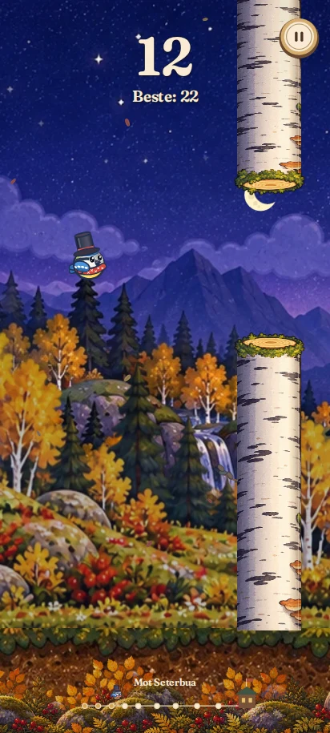

# Pixelfugl v9 – landskapet følger flyturen

V8 brukte en liten sinuspanorering i bakgrunnen. Den beveget seg bare litt og
snudde tilbake, så flyturen manglet tydelig fremdrift. V9 bruker kontinuerlig
verdensbevegelse og brede panoramaer som fører nye deler av landskapet inn fra siden.

## Fra den kjørende koden

[Se landskapet rulle videre](continuous-v9/motion.mp4).
Videoen er en kontrollert Canvas-forhåndsvisning med fast fugleposisjon og
12 poeng. Landskapsforskyvningen følger omtrent åtte sekunders normal fremdrift;
den er ikke et opptak av faktisk brukerinput. Trykk, fysikk og kollisjoner testes separat.

## Endringene

- Eget bredt dag- og nattpanorama til spilling; originalmotivet beholdes i menyen.
- Fjellene beveger seg langsommere enn et separat transparent skogslag foran dem.
  Trærne i skogslaget tegnes som hele figurer, uten oppdeling av stammer eller trekroner.
- Forskyvningen følger spillverdenens tilbakelagte avstand, uten sinus, metning
  eller reversering. Power-up som bremser flyturen bremser også landskapet.
- Tilene gjentas med en kort myk overgang mellom kantene. De speilvendes ikke.
- Bakgrunnen fyller skjermen også gjennom overgangen og ved skjermrotasjon.
- Bakke og skogslagenes underkant følger den samme fysiske bakken.
- Pause og redusert bevegelse stopper bevegelsen som før. Dag-/nattutvikling,
  naturlyder, nivåer, lagring, figuren og styringen er beholdt.
- Service worker v9 inkluderer de tre nye bildene for offlinebruk.
  Ved manglende panorama eller skogslag brukes den eksisterende bevegelige
  Canvas-bakgrunnen under spilling.

Landskapet er en illustrert løkke. Etter en hel panoramabredde vender de samme
terrengpartiene tilbake; dette er ikke en uendelig prosedyregenerert verden.
Bildelagene bygges én gang og gjenbrukes, uten pixelavlesning per frame.

## Verifikasjon

Chromium-testen består for menyer, nivåvalg, innstillinger, garderobe, lagring,
faktisk flaks/løft, pause/nedtelling, kollisjon/restart, tastatur og fem skjermstørrelser.
Den kontrollerer i tillegg faktisk tegnet landskap ved 0, 10, 20, 40, 80 og 120
sekunders simulert fremdrift: motivet endrer seg ved alle kontrollpunkter, hvert
lag fortsetter fremover, og det kommer ingen åpne hjørner ved tilovergangene.

Offlineinnlasting av alle sju bilder og font, redusert bevegelse og oppstart
uten bilder består. JavaScript-syntaks og `git diff --check` er kontrollert.
Dette er nettlesertester, ikke en måling av bildefrekvens på fysisk Samsung.

Nye bilder, metode og endelige prompter: [art/README.md](../art/README.md).
