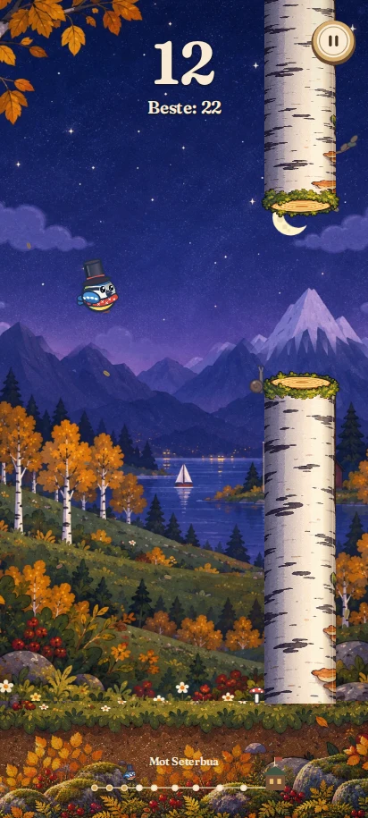

# Pixelfugl v8 – dybde med 2D-styring

Maleriet fra v7 er beholdt. Flere dybdeplan, rolig kameraføring, atmosfærisk
dis og volumlys gir spillet en 2.5D-følelse. Styring, kollisjon og fysikk foregår
fortsatt på samme 2D-plan.

## Fra den kjørende koden

[Se dybden i bevegelse](depth-v8/motion.mp4).
Dette er en kontrollert forhåndsvisning fra Canvas-rendereren ved 412 × 915,
med 12 poeng, fast fugleposisjon og forskjøvet stamme og landskap. Videoen viser
lagbevegelsen; faktisk spilling testes separat med trykk, pause og kollisjon.

## Dybdelag og lys

- Himlens, fjellenes og skogens lag panoreres med forskjellige dybdefaktorer.
  Lagene forhåndstegnes med myke masker og deles mellom skjermstørrelser.
- Panoreringen i originalmaleriet er begrenset til en liten kamerabue for å
  bevare komposisjonen og unngå gjentatte, speilvendte hytter.
- Bakken beveger seg på spillplanet; et eget transparent lag med steiner,
  mose og høstløv beveger seg raskere i nærforgrunnen.
- Dis og avstandsavhengig kameraforskyvning gir avstand mellom planene.
- Bjørkebarken har en kontinuerlig sylinderskygge og lys langs kanten.
- Fuglekroppen har mykere diffus skygge og reflekslys. Flosshatten har rundere
  materiallys. Lysretningen på kroppen beholdes når fuglen roterer.
- Bakke- og fugleskygger har mykt avtagende lys og endres med høyden over bakken.
- Menyene står i skjermplanet. Poeng har en tynn kontrastkant som gjør dem
  lesbare også når en lys bjørk passerer bak.

Det er Canvas-komposisjon med simulerte volum- og avstandssignaler, ikke en
ny 3D-motor eller 3D-kollisjon. Høstmaleriet bruker de nye bakgrunnslagene;
andre årstider beholder sine eksisterende landskap og parallakse. Fuglelys og
myke skygger gjelder alle årstider.

## Verifikasjon

Chromium-testen `tests/ui-smoke.cjs` består for nivåvalg, innstillinger,
garderobe, lagring, faktisk flaks/løft, pause/nedtelling, kollisjon/restart,
tastatur og fem skjermstørrelser. Den sjekker også:

- Dybdeplanene har ulik forskyvning, og dybdebevegelsen fryser ved pause.
- Redusert bevegelse stopper parallaksen også med alle bilder lastet inn.
- Offlineoppstart inkluderer font og alle fire bildeassets.
- Manglende bilder gir oppstart med den eksisterende Canvas-grafikken.
- Ingen JavaScript-feil eller mislykkede lokale ressurser ved normal oppstart.

JavaScript-syntaks og `git diff --check` består. Det brukes ingen skjermstore
blur-filtre eller pixelavlesninger per frame. Bakgrunnsmasker bygges én gang
ved maksimalt 640 pikslers bredde. Faktisk bildefrekvens på en fysisk Samsung
er ikke målt.

Service worker-versjonen er v8. Installerte apper må få den nye cachen og kan
trenge å lukkes og åpnes igjen. Kilder og endelig prompt for den nye grafikken
står i [art/README.md](../art/README.md).
