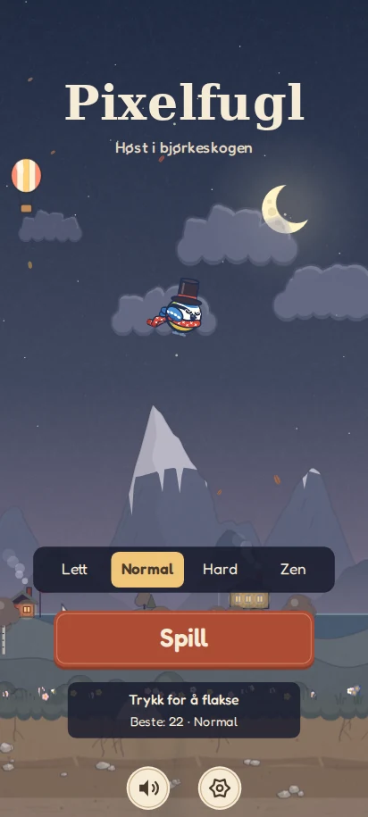
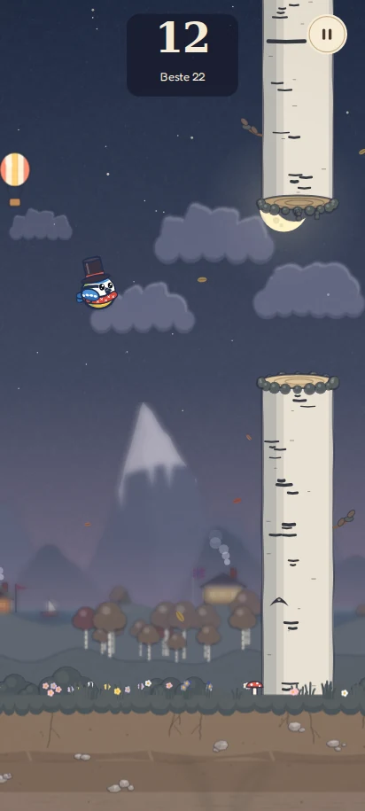
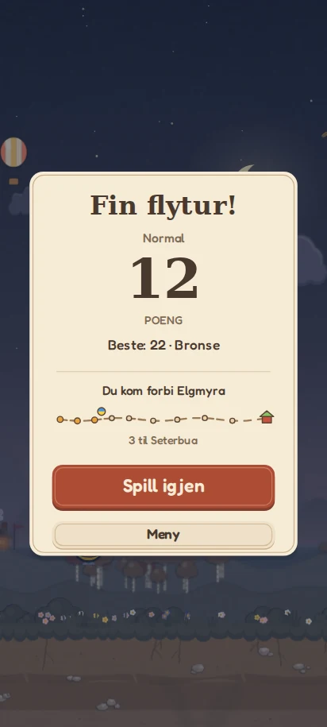

# Pixelfugl v6 – roligere og mer samlet design

Startmenyen hadde store veiviserskilt, mange separate ikonknapper og flere
forskjellige tekststiler. Versjon 6 samler nivåvalget, gir «Spill» en tydelig
plass og bruker samme paneler og typografi gjennom hele spillet.

## Faktiske visninger fra den nye koden

| Start | Spill | Resultat |
|---|---|---|
|  |  |  |

Skjermbildene er tatt i Chromium ved 412 × 915. Garderoben er satt til
flosshatt; spill- og resultatbildene viser en kontrollert forhåndsvisning med
12 poeng. Funksjonstestene bruker også faktisk trykk, kollisjon og restart.

## Endringene

- Lokalt lagret serif til logo og overskrifter; Fredoka beholdes til småtekster.
- Dempet dag-/kveldspalett, mindre korn, færre blader og roligere skyer.
- Lysere bjørkestammer om kvelden for å vise hindrene tydeligere.
- Ett samlet nivåvalg, én spillknapp, lyd og innstillinger på startskjermen.
- Innstillinger samler lydeffekter, musikk, kveldsstemning og garderobe.
- Felles paneler til pause, resultat, innstillinger og garderobe.
- Resultatet prioriterer poeng, rekord, reisen og «Spill igjen».
- Alle menyknapper har native HTML-kontroller med norske navn, valgt tilstand
  og tastaturfokus; treffområdene er de samme som på Canvas.
- Respekterer topp-/bunnutsparing. Korte og liggende vinduer får mer bredde
  i verden, med plass til panelene i høyden.
- Service worker-versjon økt til v6, med UI og den nye fonten i offline-cachen.

Spillfysikk, stammegap, power-ups, animasjoner, naturlyder, årstider,
dag-/nattutvikling, reisen hjem og opplåsingskrav er beholdt. Eksisterende
rekorder og innstillinger lagres under de samme nøklene som før.

## Verifikasjon

`tests/ui-smoke.cjs` har bestått i Chromium:

- Nivåvalg og gjenbruk av eksisterende rekord per nivå.
- Innstillinger, musikkvalg, garderobe og bevarte verdier etter ny innlasting.
- Trykk starter flyging med løft, pause fryser fuglen, nedtelling gjenopptar
  spillingen, kollisjon gir resultater, «Spill igjen» og «Meny» virker.
- Mellomrom aktiverer en fokusert knapp én gang.
- Ingen avklipte kontroller ved 320 × 568, 360 × 640, 412 × 915,
  430 × 932 og 915 × 412.
- Oppstart uten nett etter første besøk, inkludert den nye fonten og UI.
- Ingen JavaScript-feil eller mislykkede lokale ressurskall.

JavaScript-syntaks og `git diff --check` er også kontrollert.

For å kjøre selv (Node.js og Chromium/Playwright):

```sh
npm install --no-save playwright
npx playwright install chromium
node tests/ui-smoke.cjs
```

Dette er testverktøy, ikke krav for å spille eller publisere PWA-en. Ingen
byggesteg er lagt til. Testene erstatter ikke testing på en fysisk Samsung;
faktisk skjerm, lyd og ytelse bør også prøves der. Ved oppdatering av en
allerede installert PWA kan det være nødvendig å lukke og åpne den igjen
etter at den nye service workeren har lastet ned filene.
