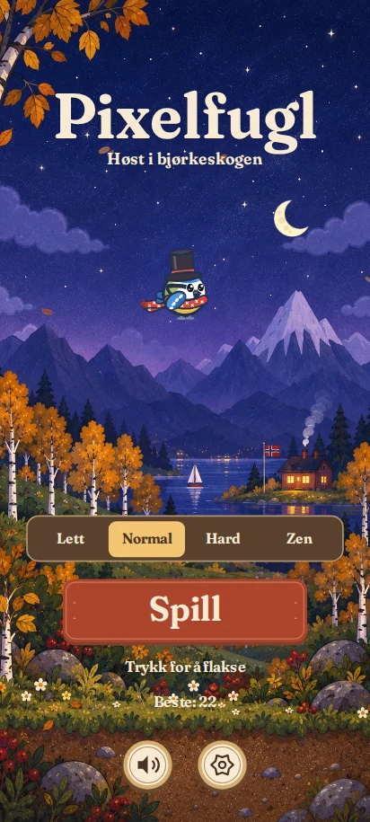
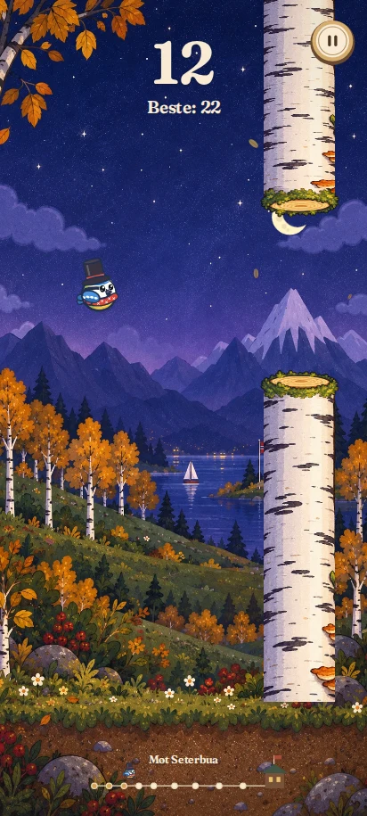
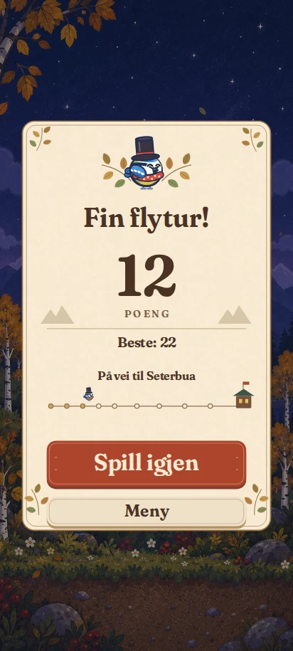

# Pixelfugl v7 – nærmere den godkjente referansen

Den første redesignen hadde riktig menystruktur, men landskapet og skriften
så enklere ut enn referansebildet. Denne revisjonen bruker malt høstgrafikk,
varmere serifskrift og et dekorert resultatkort for å følge referansen tettere.

## Faktiske skjermbilder

| Start | Spill | Resultat |
|---|---|---|
|  |  |  |

Tatt fra den kjørende koden i Chromium ved 412 × 915. Flosshatt er valgt.
Spill- og resultatbildene er kontrollerte visninger med 12 poeng;
funksjonstestene bruker i tillegg faktiske trykk, pause, kollisjon og restart.
Reisemålet følger poengsummen: ved 12 poeng er neste sted Seterbua.

## Implementasjon

- Malt høstlandskap med fjell, innsjø, hytte og bjørketrær; egne dag- og nattbilder.
- Transparent bjørkegrafikk med separat bark og snittflate. Kollisjonsbredde,
  stammegap og fysikk er uendret. Andre årstider bruker den opprinnelige tegningen.
- Lokalt lagret Fraunces med æøå, varm kremfarge og serif gjennom grensesnittet.
- Større logo, brun nivåvelger, rustrød spillknapp og hjelpetekst uten mørke bokser.
- Poeng og rekord står direkte over himmelen; pauseknappen har en lys trering.
- Resultatkort med løv, fugleillustrasjon, poeng og en illustrert reise til hytta.
- Fuglen, fallende blader, måne/sol, knapper og poeng tegnes separat fra landskapet.
  Bakgrunnen beveger seg svakt; redusert bevegelse stopper denne effekten.
- Bilder og font lagres av service workeren (v7) for offlinebruk.
  Ved mislykket bildeinnlasting starter spillet med den eksisterende Canvas-grafikken.
- Eksisterende lagringsnøkler, opplåsinger, nivåer, musikk og native HTML-knapper beholdes.

Den malte bakgrunnen erstatter høstens gamle bakgrunnslag og tilfeldige
landemerker. Reisens skilt og hjemkomst er fortsatt levende spillobjekter.
Vår, sommer og vinter beholder sine egne bakgrunnslag.

## Verifikasjon

`tests/ui-smoke.cjs` består i Chromium: nivåvalg, lagrede rekorder, innstillinger,
garderobe, lagring etter ny innlasting, trykk og løft, pause og nedtelling,
kollisjon og restart, tastaturaktivering, kontrollgrenser ved fem størrelser,
offlineinnlasting av font og alle tre bilder samt oppstart uten bildeassets.
Ingen JavaScript-feil eller mislykkede lokale ressurskall i normal kjøring.
JavaScript-syntaks og `git diff --check` er også kontrollert.

Kjøring:

```sh
npm install --no-save playwright
npx playwright install chromium
node tests/ui-smoke.cjs
```

Testene er kjørt i en nettleser, ikke på en fysisk Samsung. En installert PWA
kan trenge å lukkes og åpnes igjen etter at oppdateringen er lastet ned.
