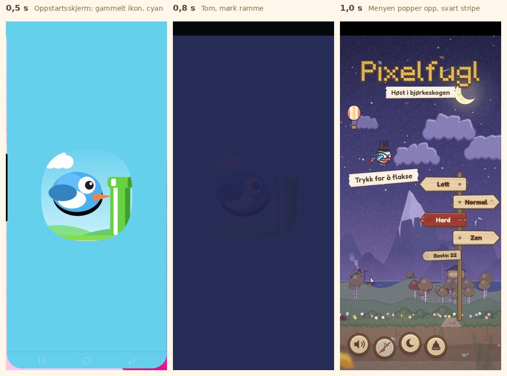
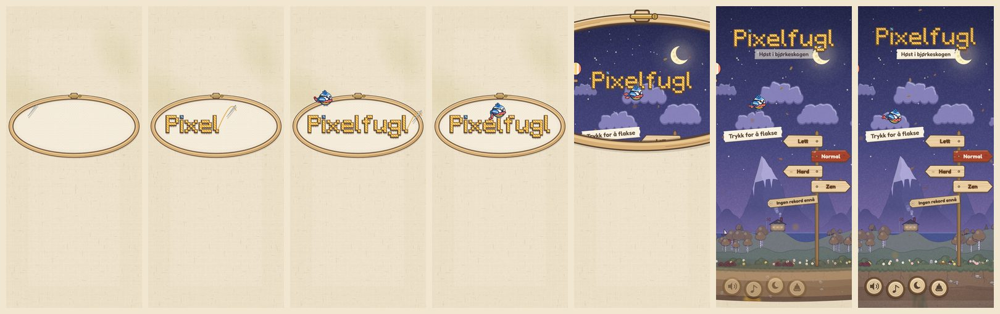

# Revisjon 4 av Pixelfugl (v5.0): første inntrykk

**Dato:** 9. oktober 2026
**Omfang:** Hele spillet etter fase H (v5.0), med vekt på oppstarten fra startskjermen på telefonen
**Metode:**

- Brukerens skjermopptak fra telefonen (9,7 s, 1080 × 2340, installert app i Chrome) er gått gjennom rute for
  rute, fem ruter per sekund.
- Gått gjennom koden for oppstart, manifest, service worker og ikoner.
- Spilt i Chromium (412 × 915, DPR 2) for å sammenligne.

Bildene ligger i [`revisjon-4/`](revisjon-4/).

---

## 1. Sammendrag

Selve spillet holder 8,5: ett designspråk i tre, papir og broderi, roligere himmel, og spillfølelse med
treffpause og tett forbi. Men de første to sekundene, før spillet i det hele tatt vises, så amatørmessige ut.

| Tid i videoen | Hva vises | Problem |
|---|---|---|
| 0,2–0,6 s | Cyan oppstartsskjerm med en generisk blå fugl og et grønt rør | Det gamle ikonet fra før fase A. Det ligner en kopi av et kjent spill. |
| 0,8 s | Tom, mørkeblå skjerm | Spillet bygger hele scenen før første bilde, og bakgrunnen er satt til nattehimmelen |
| 1,0 s | Hele menyen popper opp på én gang | Ingen inngang, ingen lyd og ingen bevegelse |
| Hele tiden | Svart stripe øverst | Fullskjermmodusen fyller ikke området rundt kameraet |

---

## 2. Poeng (v5.0)

Skala 1–10. Oppstarten er ny som eget område, fordi den er det første inntrykket hver gang appen åpnes.

| Område | v4.4 | v5.0 | Kort begrunnelse |
|---|:-:|:-:|---|
| **Design og brukergrensesnitt** | 7 | **8,5** | Ett designspråk. Installer-knappen i nettleseren er fortsatt en gul pille. |
| **Grafikk** | 8 | **8,5** | Høsttrærne i åsen ser ut som brune sopphatter om natten. |
| **Animasjoner** | 8 | **8,5** | |
| **Spillfølelse** | 7,5 | **8,5** | |
| **Oppstart og første inntrykk** *(ny)* | – | **3,5** | Gammelt ikon, feil farge, tom ramme, svart stripe og ingen intro |
| **Samlet** | 7,6 | **8,0** | Spillet ligger på 8,5, men oppstarten trekker ned |

---

## 3. Funn med bevis

1. **Gammelt ikon.**
   - Android lager en egen app (WebAPK) når spillet installeres, med ikonet slik det var da.
   - Ikonet ble byttet til blåmeisen foran bjørkestammen i fase A, men filene beholdt navnene
     `icons/icon-192.png` og så videre. Telefonen har derfor ikke oppdaget at ikonet er nytt.
2. **Cyan oppstartsskjerm.**
   - `background_color` og `theme_color` i manifestet var `#8FD3F4`, dagshimmelen.
   - Videoen er tatt om kvelden, så overgangen gikk fra cyan rett til mørkeblått.
3. **Tom, mørk ramme.** Oppstarten i `main.js` gjorde dette i rekkefølge:
   - satte bakgrunnen til himmelens farge
   - bygde hele scenen synkront (`resize()`)
   - ventet på fonten før første bilde

   Nettleseren viste den mørke bakgrunnen med et tomt lerret i mellomtiden.
4. **Menyen popper opp.** Logoen faller på plass når menyen åpnes, men det skjedde mens skjermen ennå var
   tom. Brukeren så bare en ferdig meny.
5. **Svart stripe øverst.** `display_override: ["fullscreen", …]` ga fullskjerm, men Android holdt
   området rundt kameraet svart. Når statuslinjen ble vist, lå den over en svart stripe.
6. **Installer-knappen** i nettleseren var en gul pille med skygge. Det er den siste rest av stilen fase H
   fjernet fra resten av spillet.
7. **Sopptrær.** Om natten blir høsttrærne i åsen til brune, runde kroner på tynne stammer, som ser ut som
   sopp. Det er ikke tatt i denne fasen.

---

## 4. Fase I: profesjonell oppstart (v5.1)

Valg som brukeren har tatt:

- introen «Broderiet»
- statuslinje i himmelens farge
- introen ved hver oppstart, med mulighet for å hoppe over

| Tiltak | Hva |
|---|---|
| **I1 Én kjede fra ikon til spill** | Oppstartsskjermen og siden er lin (`#F1E6D0`) fra første bilde. Ikonfilene har fått nye navn (`icons/pixelfugl-*.png`), så Chrome oppdager det nye ikonet. Spillet begynner å tegne med en gang, og introen dekker oppbyggingen. |
| **I2 Introen «Broderiet»** | Se under. |
| **I3 Statuslinjen** | Vanlig visning (`standalone`) i stedet for fullskjerm. Statuslinjen får himmelens farge (`theme-color`) og skifter med dag, kveld og natt. Under introen er den lin. |
| **I4 Installer-knappen** | En rødmalt planke som knappene i spillet. Den vises først når introen er ferdig. |

### Introen «Broderiet» (cirka 2,7 s)

| Tid | Hva skjer |
|---|---|
| 0–0,3 s | En oval broderiramme av bjørk, med lås og messingskrue, setter seg på linet. Inne i rammen er stoffet aida, med ruter som går nøyaktig opp med stingene. |
| 0,3–1,3 s | En synål syr «Pixelfugl» sting for sting, bokstav for bokstav, med tråd fra siste sting til nåløyet (blå tråd til i-prikken). Hver bokstav gir en stille kalimbatone som stiger i F-dur. |
| 1,2–1,75 s | Blåmeisen flyr inn i en bue og lander på den første «l»-en, med et kort meisekall. |
| 1,95–2,55 s | Rammen vokser forbi kameraet, og stoffet i den toner bort, så verden kommer til syne. Logoen glir opp på plassen sin i menyen, og fuglen letter og glir ned til hvileplassen. |
| 2,7 s | Menyen, med statuslinjen i himmelens farge |

Detaljer som gjør at det henger sammen:

- **Samme logo:** introen syr i de samme tre lagene som `buildLogo` (skygge, kontur, sting), med den samme
  ujevnheten. Den ferdigsydde logoen er derfor lik menylogoen, og det blir ikke noe hopp når menyen tar over.
- **Ingen hakk:** menyen tegnes én gang skjult under linet mens ingenting beveger seg. Bildene havner da i
  hurtigbufferen før åpningen.
- **Riktig font:** lerretet åpner seg ikke før fonten er lastet (høyst 2,5 s ventetid). Papirlappene i menyen
  blir dermed aldri lagret med feil skrift.
- **Hopp over:** et trykk eller en tast spoler fram til åpningen, og starter ikke spillet.
- **Bare ved oppstart:** introen vises ikke når du går tilbake til menyen fra et spill.
- **Redusert bevegelse:** ingen nål og ingen flukt. Logoen står ferdig sydd i rammen, og linet toner rolig bort
  på cirka 1 s.
- **Lyd:** spilles bare i den installerte appen, der Chrome tillater lyd før første trykk. I nettleseren er
  introen stille.
- **Ingen vibrasjon** før brukeren har trykket.

---

## 5. Poeng etter fase I (v5.1)

| Område | v5.0 | v5.1 | Hva flyttet poengene |
|---|:-:|:-:|---|
| Design og brukergrensesnitt | 8,5 | **8,5** | Installer-knappen er i samme stil, men ellers uendret |
| Grafikk | 8,5 | **8,5** | Sopptrærne om natten står igjen |
| Animasjoner | 8,5 | **9** | Introen er et særpreget, håndlaget øyeblikk: sting for sting, en fugl som lander, og en ramme som åpner seg mot verden |
| Spillfølelse | 8,5 | **8,5** | |
| **Oppstart og første inntrykk** | 3,5 | **8,5** | Én kjede i samme materiale fra ikon til meny, uten tom ramme eller svart stripe |
| **Samlet** | 8,0 | **8,6** | |

Oppstarten får ikke 9 ennå: oppstartsskjermen tegnes av Android og kan ikke animeres. Det nye ikonet kommer
heller ikke på telefoner som har appen fra før, før Chrome har oppdatert den eller appen er installert på
nytt.

### Det som står igjen

- **Sopptrærne om natten** (punkt 7 over).
- **Installerte telefoner:** fjern appen fra startskjermen og installer den på nytt for å få det nye ikonet og
  oppstartsskjermen med en gang.

### Verifisering

Kjørt i Chromium uten GPU, 412 × 915 og DPR 2–2,625.

- **`phaseI-test.js`: 48 av 48 kontroller består.**
  - Manifest, ikoner og service worker. Ingen henvisninger til de gamle ikonnavnene.
  - Alle bilder før åpningen er lin, så det er ingen mørk ramme.
  - Introen varer cirka 2,6 s i sanntid, med ni bokstavtoner, landing og åpning.
  - Den ferdigsydde logoen avviker fra menylogoen i høyst 4 av 255 i én fargekanal, ingen piksler mer enn 8.
  - Fuglen står på «l»-en, og logoen ender nøyaktig på menyplassen.
  - Hopp over med trykk og med mellomrom (cirka 0,3 s), uten at spillet starter.
  - Ingen ny intro når du går tilbake til menyen.
  - Introen venter på fonten.
  - Redusert bevegelse: cirka 1,0 s.
  - Lyd bare i den installerte appen, og statuslinjen i himmelens farge.
  - Ingen hakk i åpningen, og tegnetid mot v5.0 i meny, spill og game over innenfor +8 %.
  - Menylogoen er piksel for piksel den samme som i v5.0.
- **Eldre suiter:** introen avsluttes etter at fonten er lastet, siden suitene tester det som kommer etter. Se
  status i PR-en.
