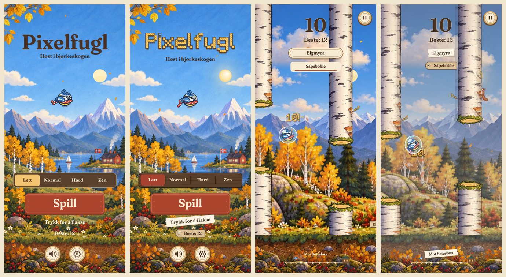
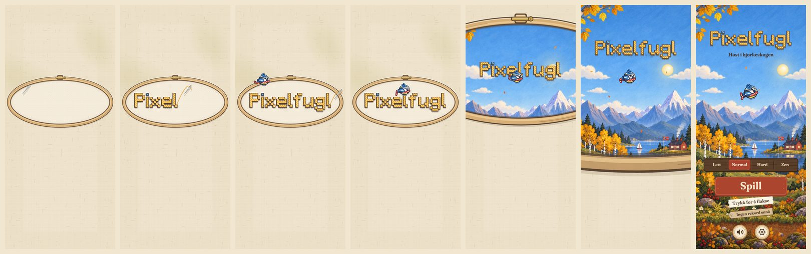
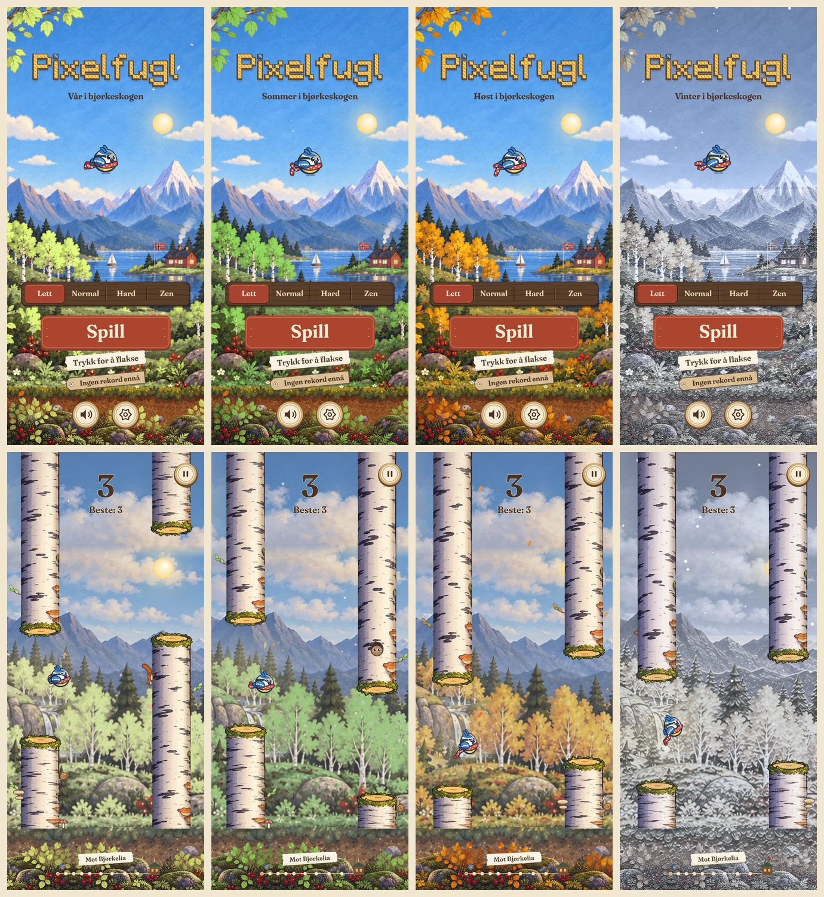
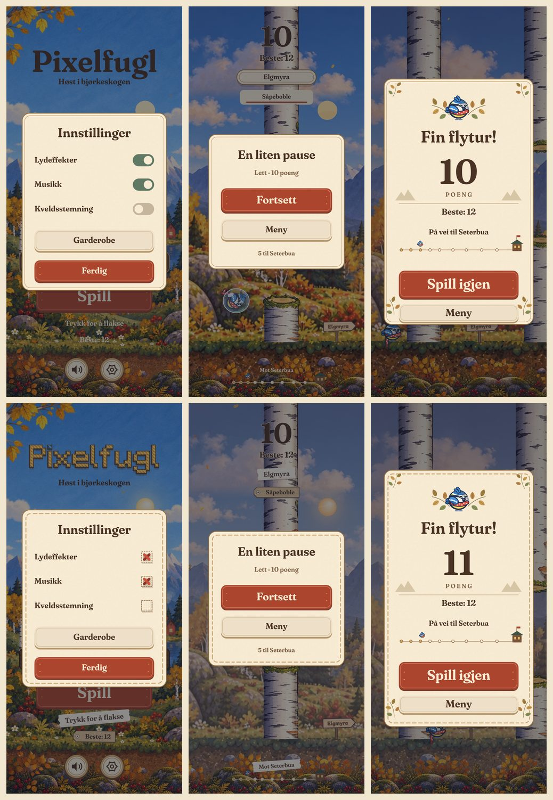

# Revisjon 5 av Pixelfugl (v9): designet fra ChatGPT

**Dato:** 9. oktober 2026
**Omfang:** Hele spillet slik det ble etter endringene laget med ChatGPT (v9 i `main`), og fase J (v10)
**Metode:**

- Skjermbilder av alle skjermer og alle årstider, dag og kveld, i Chromium (412 × 915, DPR 2).
- Gått gjennom koden i `js/ui.js`, `js/art.js` og kildene i `art/README.md`.
- Målt det som kan måles:
  - metning og uro (variasjon i lysstyrke) i bakgrunnen bak spillet
  - lange oppgaver på hovedtråden ved oppstart
  - tegnetid per bilde mot v9

Bildene ligger i [`revisjon-5/`](revisjon-5/).

---

## 1. Sammendrag

ChatGPT-versjonen ga spillet en tydeligere struktur, men tok bort det som gjorde det særpreget. Den malte
høstskogen ser rik ut ved første blikk, men den er AI-generert. Den passer ikke sammen med de flate
vektorelementene oppå, og fuglen og stammene drukner i den mens du spiller. Bare høsten var malt. Korssting-logoen
var byttet ut med en vanlig serif, og grensesnittet besto av standardkomponenter.

Brukeren valgte å **beholde maleriene og harmonisere dem**. Fase J (v10) gjør derfor tre ting:

- Bakgrunnen dempes bak selve spillet.
- Maleriet fargelegges for hver årstid.
- Den broderte logoen og materialene kommer tilbake: tre, papir og broderi.

ChatGPTs gode struktur er beholdt.

---

## 2. Poeng (v9)

Skala 1–10.

| Område | v5.0 | v9 | Kort begrunnelse |
|---|:-:|:-:|---|
| **Design og brukergrensesnitt** | 8,5 | **7** | Tydeligere struktur, men generiske mobilmønstre og tekst rett på et urolig maleri |
| **Grafikk** | 8,5 | **6** | Rikt ved første blikk, men typisk AI-preg, stilbrudd og ulik stil fra årstid til årstid |
| **Animasjoner** | 8,5 | **7,5** | Fuglen og parallaksen er beholdt, men det har ikke kommet til noe nytt |
| **Spillfølelse** | 8,5 | **6,5** | Fuglen og stammene drukner i bakgrunnen |
| **Oppstart og første inntrykk** | 3,5 | **3** | Venter på 3 MB bilder før første bilde. Fortsatt svart stripe og gammelt ikon. |
| **Samlet** | 8,0 | **6,5** | |

### Dette gjorde ChatGPT bra (og det er beholdt)

- Ett nivåvalg og én tydelig «Spill»-knapp. Innstillingene er samlet i ett panel.
- Resultatkortet er godt organisert, med poeng, rekord og reisen hjem.
- Knappene finnes også som ekte HTML-knapper, med tastaturfokus og norske navn.

---

## 3. Funn med bevis

1. **Grafikken er AI-generert.**
   - `art/README.md` sier selv at bildene er laget med OpenAI imagegen, og gjengir promptene.
   - Uttrykket er akkurat AI-stilen brukeren vil bort fra:
     - jevn mikrodetalj overalt
     - mettede farger
     - et samlebilde av klisjeer (flagg, rød hytte, seilbåt og foss i samme bilde)
2. **Stilbrudd.**
   - Fuglen, sola og skiltene er flate vektortegninger oppå et detaljert maleri.
   - Maleriet er forstørret omtrent 2,5 ganger og ser uskarpt ut ved siden av den skarpe fuglen.
3. **Lesbarheten i spill er dårligere.**
   - Fuglen kamuflerer seg i gule trær og røde bær.
   - Hvit tekst står rett på løvet.
   - Målt bak spillet: metning 0,529 og uro 52,4.
4. **To spill i ett.** Bare høsten var malt. Sommer, vinter og vår hadde den gamle pastellstilen.
5. **Identiteten er borte.**
   - Korssting-logoen var byttet ut med Fraunces, en svært vanlig «koselig app»-skrift.
   - Grensesnittet var standardkomponenter:
     - en segmentvelger
     - iOS-brytere
     - kremkort med kvister
     - en pille med «Trykk hvor som helst»
6. **Tyngre og tregere oppstart.** Bildene er på 3 MB (spillet var på omtrent 1 MB). Menyen ble vist først når
   alle var lastet og dekodet på hovedtråden.

---

## 4. Fase J: harmonisert maleri (v10)

Valg som brukeren har tatt:

- **Retning:** behold maleriene, men harmoniser dem
- **Årstider:** fargelegg maleriet i koden
- **Logo:** den broderte korssting-logoen

| Tiltak | Hva |
|---|---|
| **J0 Slå sammen** | v9 og introen «Broderiet» (fase I) er slått sammen. Introen er tilpasset de nye skjermene og de nye HTML-knappene. |
| **J1 Lesbarhet i spill** | Bildene bak spillet (panorama og skogslag) får lavere metning og kontrast og et tynt dislag. Menyen beholder maleriet i full styrke. |
| **J2 Ett uttrykk** | Fuglen får malt korn og varmt kantlys fra sola. Sola og månen er malt (glød, penselstrøk, månesigd med hav) i stedet for flate sirkler. |
| **J3 Tekst og knapper** | Tekst står ikke lenger rett på maleriet. Se under. |
| **J4 Årstidene** | Maleriet fargelegges i koden (se under), så det er samme stil hele året. |
| **J5 Brodert logo** | Korssting-logoen står på maleriet som et brodert merke. Introen syr den og slipper den nøyaktig på plassen i menyen. |
| **J6 Oppstart og ytelse** | Bildene hentes, dekodes og fargelegges i en egen tråd mens introen går. Se under. |

### J3: Tekst og knapper

| Før (v9) | Etter (v10) |
|---|---|
| Segmentvelger for nivå | En tresprosse av valnøtt med rødt innlegg under valgt nivå |
| iOS-brytere i innstillingene | Broderte avkrysningsfelt: en aida-rute med et rødt korssting |
| Pille med «Trykk hvor som helst» | Papirlapp |
| Hint og rekord rett på maleriet | «Trykk for å flakse» på papirlapp, rekorden på en merkelapp |
| Stedsnavn og power-ups som tekst i spill | Stedsnavnet og «Mot …» på papirlapp. Power-ups på merkelapp, med en rød tråd som viser tiden som er igjen. |
| Kremkort | Kort med sydd kant, som broderiet i logoen |

### J4: Årstidene

Fargeleggingen gjøres i en egen tråd (Web Worker), piksel for piksel:

| Årstid | Hva skjer med maleriet |
|---|---|
| Høst | Originalen |
| Sommer | Høstløvet flyttes mot grønt. Jorda og de røde bærene holdes utenfor. |
| Vår | Lysere og friskere grønt |
| Vinter | Kaldt og blekt, med rimfrost på flatene som vender opp |

- Bjørka beholder barken (ellers ville kjukene blitt grønne). Den får bare et kaldt skjær om vinteren.
- Uten Web Worker gjøres fargeleggingen på hovedtråden, og maleriene vises likevel.

### J6: Oppstart og ytelse

**Oppstart:**

- Tråden henter og dekoder bildene selv og sender ferdige bilder (ImageBitmap) tilbake. Hovedtråden stopper
  derfor ikke mens introen beveger seg.
- Høstbildene dekodes i tråden uten fargelegging.
- Bildene bak spillet fargelegges først når introen er ferdig.

**Ytelse:**

- Logoen legges på hele skjermpiksler, så nettleseren kopierer stingene rett over. Det er omtrent seks ganger
  raskere enn å filtrere dem.
- Kortene tegnes én gang per størrelse.
- Kornet på fuglen ligger ferdig i en rund flis.
- Den malte sola og månen legges på hele piksler.
- Knappelaget skrives bare når det endres.

**Resultatkortet** har fått luft under knappene, så «Meny» ikke lenger ligger over den sydde kanten.

---

## 5. Poeng etter fase J (v10)

| Område | v9 | v10 | Hva flyttet poengene |
|---|:-:|:-:|---|
| Design og brukergrensesnitt | 7 | **8,5** | Materialer med særpreg (tre, papir, broderi) i stedet for standardkomponenter, og ingen tekst rett på maleriet. Strukturen fra v9 er beholdt. |
| Grafikk | 6 | **7,5** | Ett uttrykk i alle årstider, malt lys på fuglen og malt sol og måne. Maleriene er fortsatt AI-genererte, så preget er mindre, men ikke borte. |
| Animasjoner | 7,5 | **8,5** | Introen er tilbake og ender sømløst i maleriet |
| Spillfølelse | 6,5 | **8** | Bakgrunnen bak spillet er roligere (metningen er 46 % lavere og uroen 28 % lavere), så fuglen og stammene leses |
| Oppstart og første inntrykk | 3 | **8** | Lin fra første bilde, introen og ingen stopp mens den beveger seg. Første besøk laster fortsatt 3 MB. |
| **Samlet** | **6,5** | **8,1** | |

### Det som står igjen

- **Maleriene er AI-genererte.**
  - Klisjeene i dem (flagg, seilbåt, foss) og forstørrelsen på omtrent 2,5 ganger kan ikke rettes i koden.
  - Skal grafikken over 8, trenger spillet malerier laget for hånd, eller den håndlagde retningen uten malerier.
- **3 MB bilder.**
  - Første besøk laster alle bildene. Introen venter høyst 2,5 s ved landingen før den åpner seg.
  - Når appen er installert, ligger bildene i service workeren.

### Verifisering

Kjørt i Chromium uten GPU, 412 × 915 og DPR 2–2,625. Tegnetid er median av vekselvise runder mot v9.

- **`phaseJ-test.js`: 34 av 34 kontroller består.**
  - Alle fire årstider viser maleriene, og alle sju lag er ferdig fargelagt, uten feil.
  - Sommer og vår er grønnere enn høsten. Vinteren er kaldere og har under 70 % av høstens metning.
  - Bak spillet er metningen 0,286 mot 0,529 i v9 (−46 %), og uroen 37,8 mot 52,4 (−28 %).
  - Menyen viser høstmaleriet uendret: snittavviket er under 1 av 255 i full oppløsning.
  - Den broderte logoen står på maleriet, og introen slipper den nøyaktig der menyen tegner den.
  - Ingen lys tekst rett på maleriet. Tresprossen, de broderte avkrysningsfeltene, papirlappene, merkelappene
    og den malte sola og månen er på plass.
  - Ingen stopp over 50 ms mens introen beveger seg. De lange oppgavene ligger før første bilde og mens fuglen
    står stille på logoen.
  - Uten Web Worker fargelegges maleriene likevel.
  - Under introen er knappelaget skjult, og et trykk hopper over introen uten å starte spillet.
  - Tegnetid mot v9 (median av 9 vekselvise runder): meny +0,3 %, spill −6,9 %, game over −9,1 %.
  - Ingen emoji eller symboltegn i kildefilene.
- **`phaseI-test.js` (introen, oppdatert til v10): 45 av 45 kontroller består.**
  - Alle 304 bilder før åpningen er lin.
  - Introen varer 2,63 s i sanntid. Hopp over tar cirka 0,3 s, og redusert bevegelse cirka 1,0 s.
  - Den ferdigsydde logoen avviker fra menylogoen i høyst 4 av 255 i én fargekanal, ingen piksler mer enn 8.
  - Menylogoen er piksel for piksel den samme som i v5.0.
- **`tests/ui-smoke.cjs` (repoets egen test fra v9) består.** Den dekker:
  - meny, nivå, innstillinger, garderobe og lagring
  - fysikk, pause, død og nytt forsøk, og tastatur
  - fem skjermstørrelser
  - offline med malerier og font
  - to minutter sammenhengende reise
  - redusert bevegelse
  - reserve når maleriene mangler
- **Eldre suiter (fase A–H)** tester grafikken fra v5, som v9 erstattet med maleriene. De er ikke kjørt mot v10.
