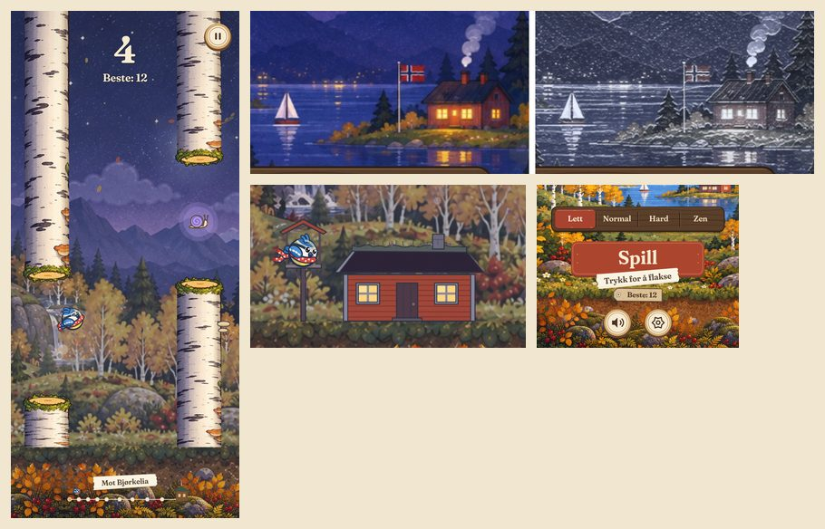
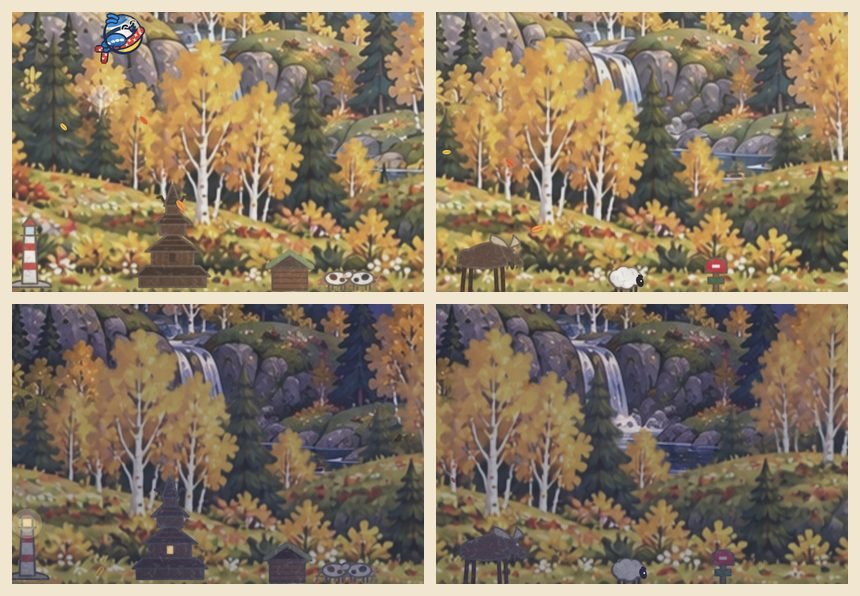
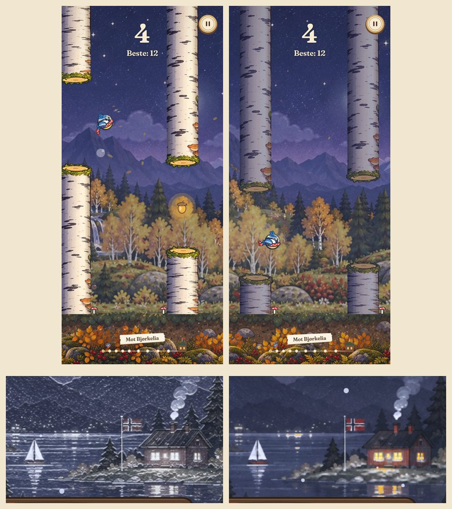
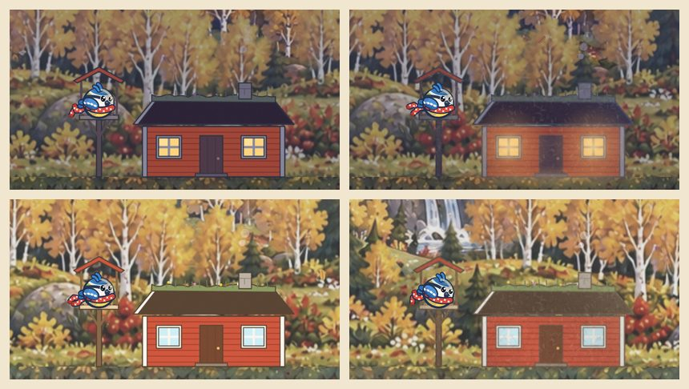
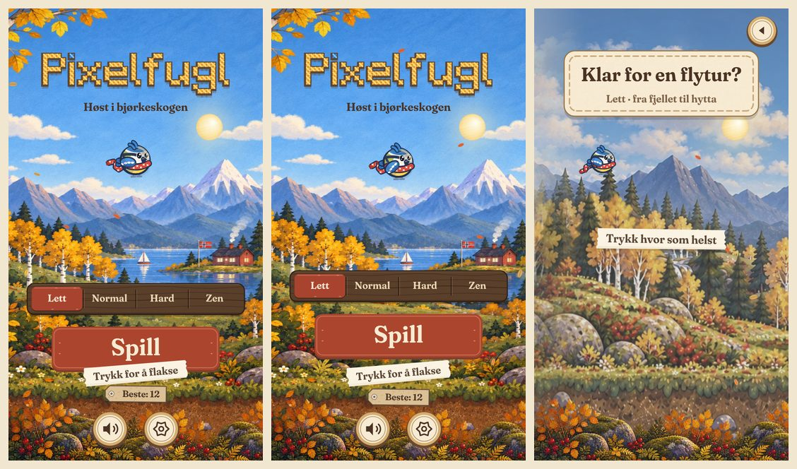

# Revisjon 6 av Pixelfugl (v10): det malte landskapet hele døgnet og hele reisen

**Dato:** 9. oktober 2026
**Omfang:** v10 slik den ble merget (fase J), med vekt på tilstandene som ikke ble sett nøye i revisjon 5
**Metode:**

- Spilt gjennom i Chromium (412 × 915, DPR 2). Disse tilstandene ble sett nøye:
  - kveld og natt
  - vinterkveld
  - solnedgang
  - hjemkomsten ved 60 poeng
  - ny rekord
  - garderoben
- Små og store telefoner (360 × 640 og 430 × 932).
- Gått gjennom koden for det som tegnes på maleriet. Målt tegnetid og lange oppgaver mot v10.

Bildene ligger i [`revisjon-6/`](revisjon-6/).

---

## 1. Sammendrag

Høst om dagen er det beste spillet har sett ut, men resten av døgnet og resten av reisen holdt ikke samme
nivå. I v10 ble maleriet brukt i alle årstider, og det fikk en bivirkning: landemerkene, ballongen og
fugleflokken ble bare tegnet i landskapet som tegnes i koden. Dermed var de borte hele året. Om kvelden lyste
stammene som om det var dag. Vinteren så ut som et filter, og hytta ved hjemkomsten var en flat tegning midt i
maleriet.

---

## 2. Poeng (v10)

Skala 1–10. «Ved levering» er vurderingen i revisjon 5.

| Område | v10 ved levering | v10 nå | Hvorfor |
|---|:-:|:-:|---|
| **Design og brukergrensesnitt** | 8,5 | **8** | Materialene og kortene er samlet og særpreget. Men tekst kolliderer på små telefoner, og menyhintet stemmer ikke. |
| **Grafikk** | 7,5 | **7** | Høst om dagen er fin og samlet. Natt, vinter og hjemkomsten bryter med stilen. |
| **Animasjoner** | 8,5 | **8** | Introen og fuglen er sterke, men maleriet er ellers stille: ballongen, fugleflokken og landemerkene vises ikke. |
| **Spillfølelse** | 8 | **7,5** | Fuglen og stammene er lette å lese, men reisen hjem har bare navn på skilt. |
| **Oppstart og første inntrykk** | 8 | **8** | Introen virker som den skal. |
| **Samlet** | 8,1 | **7,7** | |

---

## 3. Funn med bevis

1. **Landemerkene var borte.**
   - Fyret, stavkirka, setra, elgen, sauen og postkassa ble tegnet i `drawScenery` og `drawWorld` bare når
     maleriet ikke ble brukt. Det samme gjaldt ballongen og fugleflokken.
   - I v9 gjaldt det bare høsten. Fra v10 gjaldt det hele året.
2. **Stammene lyste om natten.** Bjørkebildet ble tegnet med samme dagslys døgnet rundt, mens alt annet ble
   mørkt og blått.
3. **Vinteren så ut som et filter.**
   - Varme vinduslys, den røde hytta og lysene over fjorden ble grå.
   - Rimfrosten ble regnet ut fra forskjellen mot pikselen to rader lenger ned. Det gir hvit støy på hver
     kant, også på vannet og fjellene.
4. **Hjemkomsten var en flat tegning.** Hytta og fuglebrettet hadde svarte konturer og flate farger midt i
   maleriet, i spillets største øyeblikk.
5. **Små telefoner (360 × 640).** Papirlappen «Trykk for å flakse» lå over «Spill»-knappen.
6. **Hintet i menyen stemte ikke.** Det sto «Trykk for å flakse», men et trykk på maleriet gjorde ingenting.
7. **«Klar for en flytur?»** sto rett på maleriet.
8. **Stopp ved kvelden.** Panoramaet og skogslaget for natten ble laget i bildet der kvelden kom. I dette
   miljøet ga det et stopp på 130–170 ms.

---

## 4. Fase K (v10.1)

Brukerens valg: alle fem tiltakene.

| Tiltak | Hva |
|---|---|
| **K1 Landemerkene tilbake** | Landemerkene står på enga foran skogen og følger den. Fjorden er skjult bak skogen mens man flyr, så fyret står på sitt eget skjær. Postkassa står ved stien. Ballongen og fugleflokken krysser himmelen. Tjernet vises ikke på maleriet, som har vann fra før. |
| **K2 Stammene følger lyset** | Bjørkebarken blir kjølig og mørkere om kvelden, med månelys i kanten, og varm i solnedgangen. Det gjelder både barken og snittflatene. |
| **K3 Vinter uten filterpreg** | Se under. |
| **K4 Malt hjemkomst** | Hytta og fuglebrettet får samme malte behandling, og vinduene gløder om kvelden med et lysskjær på bakken. |
| **K5 Tekst og trykk** | Se under. |

### K3: Vinter uten filterpreg

- Rimfrosten regnes ut fra lysstyrken jevnet ut over 4 px, så den legger seg mykt på flater som vender opp:
  tak, steiner og trekroner.
- Vannet får ikke rim.
- Varme lys om kvelden beholder fargen. Et lys kjennes igjen på at det er mye lysere enn det som er rundt det,
  mens et lyst løvfelt ikke er det.
- Den røde hytta og rognebærene beholder mer av fargen.

### K5: Tekst og trykk

- Hintet, rekorden og ikonene står i forhold til «Spill», og hele blokken løftes på lave skjermer.
- Et trykk på maleriet i menyen starter spillet, men ikke når et panel er åpent.
- «Klar for en flytur?» står på et kort med sydd kant.

### Malt behandling av det som er tegnet i koden

Landemerkene, ballongen og hytta er tegnet i koden. Når de settes inn i maleriet, får de:

- myke kanter: en uskarp kopi legges over, så kantene blir penselstrøk i stedet for tusj
- metning og kontrast som foran skogen
- malt lys fra sola oppe til høyre, eller kjølig månelys om kvelden
- korte penselstrøk og korn over flatene
- en målestokk som passer trærne i maleriet

Alt dette lages én gang for hver tid på døgnet, mens fuglen venter på «Klar?». Det samme gjelder den tonede
bjørkebarken og nattlagene i maleriet, så byttet fra dag til kveld ikke hakker.

---

## 5. Poeng etter fase K (v10.1)

| Område | v10 nå | v10.1 | Hva flyttet poengene |
|---|:-:|:-:|---|
| Design og brukergrensesnitt | 8 | **8,5** | Ingen overlapp på små telefoner, hintet stemmer, og ingen tekst står rett på maleriet. |
| Grafikk | 7 | **7,5** | Natt, vinter og hjemkomsten er i samme stil som resten. Maleriene er fortsatt AI-genererte, og landemerkene er enklere tegnet enn maleriet rundt dem. |
| Animasjoner | 8 | **8,5** | Ballongen, fugleflokken, sauen som beiter og fyrlyset er tilbake, og vinduene gløder om kvelden. |
| Spillfølelse | 7,5 | **8,5** | Reisen hjem har landemerker igjen, et trykk starter fra menyen, og det kommer ingen topp når kvelden kommer. |
| Oppstart og første inntrykk | 8 | **8** | Uendret. |
| **Samlet** | **7,7** | **8,2** | |

### Det som står igjen

- **Maleriene er AI-genererte.** Klisjeene i dem og forstørrelsen på omtrent 2,5 ganger kan ikke rettes i
  koden. Skal grafikken over 8, trengs malerier laget for hånd, eller den håndlagde retningen uten malerier.
- **Landemerkene er tegnet i koden.** Med den malte behandlingen passer de bedre inn, men de er enklere enn
  maleriet rundt dem.
- **Tjernet** har bare skiltet på maleriet.
- **Første besøk** laster 3 MB med bilder.

### Verifisering

Kjørt i Chromium uten skjermkort, 412 × 915 og 360 × 640, DPR 2–2,625. Tegnetid er median av 9 vekselvise
runder mot v10.

- **`phaseK-test.js`: 30 av 30 kontroller består.**
  - **K1:**
    - Alle seks landemerkene tegnes på maleriet i sin malte utgave, og bildet endrer seg der de står.
    - Landemerkene følger enga (samme fart som skogen), og postkassa følger stien.
    - Tjernet kommer ikke på maleriet, og reisen begynner med tom horisont.
    - Den malte utgaven har nesten tre ganger så mange myke kantpiksler og 39 % lavere metning enn den tegnede.
    - Ballongen tegnes på reisen, men ikke i menyen.
  - **K2:**
    - Bjørkebarken har 34 % lavere lysstyrke og er kjøligere om natten, og den er varmere i solnedgangen.
    - I spill er stammen 24 % mørkere om natten enn om dagen.
    - Tonene lages mens fuglen venter på «Klar?».
  - **K3**, vinterkveld mot v10:
    - 139 varme lyspiksler rundt hytta, mot 0.
    - Støyen er 55 % lavere på vannet og 21 % lavere på fjellet.
    - Den røde hytta beholder fargen om dagen.
  - **K4:** hjemkomsten tegnes i maleriets utgave, med glødende vinduer om kvelden.
  - **K5:**
    - Ingen overlapp i menyen på 360 × 640 eller 412 × 915.
    - Et trykk på maleriet starter, men ikke når et panel er åpent.
    - «Klar?» står på et kort.
  - **Lang runde fra dag til natt med landemerker,** mot v10:
    - færre stopp over 70 ms (4 mot 5)
    - lengste stopp 89 ms mot 134 ms
    - ved overgangen til natt 79 ms mot 134 ms
  - **Tegnetid mot v10:** meny +0,3 %, spill +2,5 % (med et landemerke i bildet), game over +2,0 %.
  - Ingen feil, ingen emoji eller symboltegn, og service workeren er på versjon 10.1.
- **`phaseJ-test.js`: 34 av 34 består.** Den dekker årstidene, lesbarheten mot v9, logoen, komponentene,
  oppstarten uten stopp og tegnetiden mot v9.
- **`phaseI-test.js`: 45 av 45 består.** Den dekker introen.
- **`tests/ui-smoke.cjs`** (repoets egen test) består, også kontrollen av at et trykk ved siden av et åpent
  panel ikke starter spillet.
