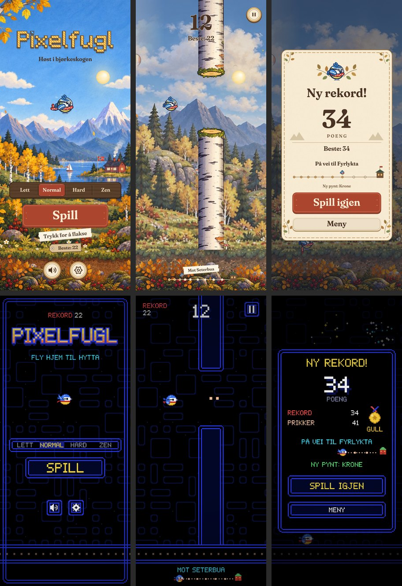
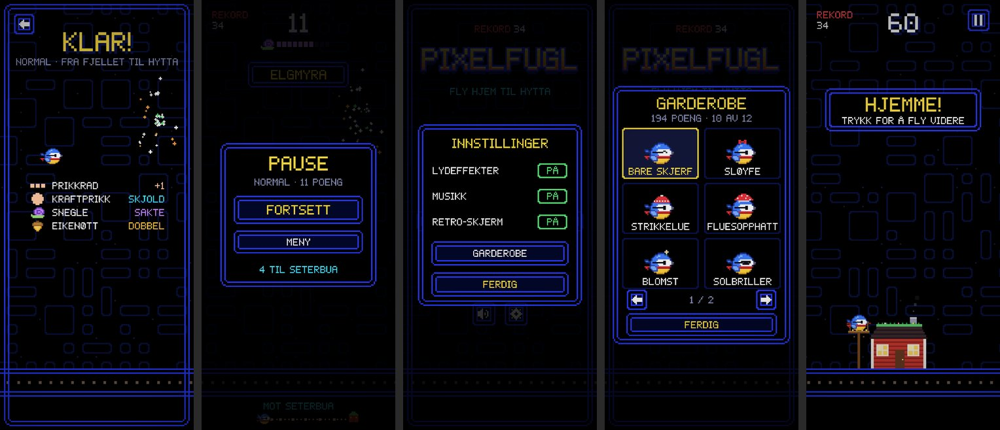
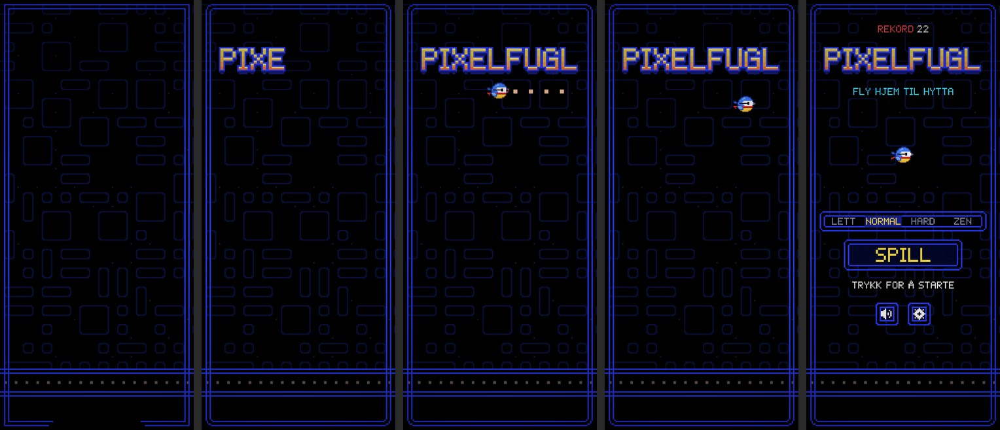
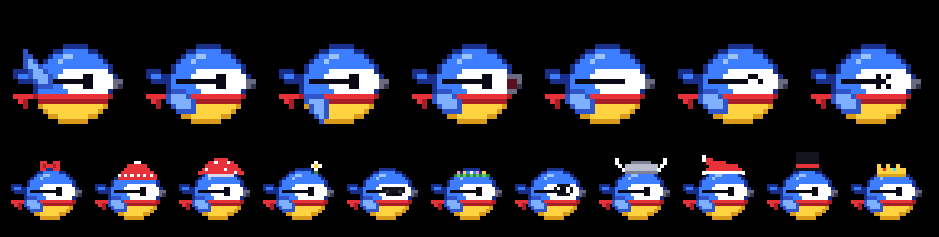

# Revisjon 7 av Pixelfugl (v11): arkadespillet

**Dato:** 10. oktober 2026
**Omfang:** hele spillet laget på nytt i arkadestil (fase L), sammenlignet med v10.1 slik den ble merget

**Metode:**

- Spilt gjennom i Chromium, i stående format på 412 × 915, 360 × 640 og 320 × 568, og liggende på 915 × 412.
- Målt nedlasting, tegnetid og stopp mot v10.1 i samme nettleser.

Bildene ligger i [`revisjon-7/`](revisjon-7/).

---

## 1. Ønsket

> «Jeg vil at stilen skal se helt lik Pac-Man, fuglen skal være Pac-Man, en blå kopi av spillet Pac-Man, men
> skal fly som Flappy Bird.»

Pac-Man (figuren, spøkelsene, lydene og spillets utseende) tilhører Bandai Namco. Spillet er derfor laget som
en **hyllest** til arkadehallenes labyrintspill, ikke som en kopi:

- ingen gul rund figur med kilemunn
- ingen spøkelser
- ingen kjente melodier eller lyder fra andre spill
- all musikk og alle lyder er laget for Pixelfugl

Det som hører sjangeren til og ikke er noens eiendom, er brukt:

- svart skjerm og doble blå labyrintvegger
- prikker å spise og en stor kraftprikk
- pikselskrift og «KLAR!» før start
- rekorden øverst
- chiptune

Brukerens valg:

| Spørsmål | Valg |
|---|---|
| Figuren | **Arkade-blåmeis:** blåmeisen som en rund 8-bits figur der nebbet åpner seg når den spiser |
| Omfang | **Erstatt alt:** hele spillet blir arkade. Den gamle stilen finnes bare i git-historikken. |
| Spillet | **Prikker å spise:** prikker i åpningene gir ekstra poeng, og en kraftprikk gir skjold. Ellers flyr den som i Flappy Bird. |

---

## 2. Før og etter

---

## 3. Fase L (v11)

| Tiltak | Hva |
|---|---|
| **L1 Pikselgrunnlaget** | Se under. |
| **L2 Verden** | Se under. |
| **L3 Arkade-blåmeisen** | Se under. |
| **L4 Arkademenyer** | Se under. |
| **L5 Intro og chiptune** | Se under. |
| **L6 Opprydding** | Se under. |

### L1 Pikselgrunnlaget

- En egen 5 × 7-pikselskrift med A–Å, É, tall og tegnsetting. 0 har prikk, så den skilles fra O og Ø.
- Sprites fra rutenett.
- Doble labyrintrammer med pikselrunde hjørner.
- Hver kunstpiksel legges på hele skjermpiksler, så pikslene er like store og skarpe også når skjermen har
  en skjev skalering.

### L2 Verden

- Svart skjerm.
- Veggene er doble blå streker med runde ender mot åpningen.
- I hver åpning ligger tre prikker. En full rad gir ett ekstra poeng.
- Kraftprikken (skjold), snegla (sakte film) og den gylne eikenøtta (dobbel) ligger i åpningene.
- En svak labyrint glir sakte forbi bak veggene, og gulvet har en korridor med prikker.

### L3 Arkade-blåmeisen

- Rund 8-bits figur:
  - blå hette, hvitt ansikt med svart øyestripe og gult bryst
  - rødt skjerf som blafrer bak
  - tre vingestillinger
  - nebbet åpner seg når den spiser
  - øyne som blunker, smiler og blir svimle
- Den roteres i kunstpiksler, så den er skarp når den vipper.
- All pynten i garderoben er tegnet på nytt i piksler.

### L4 Arkademenyer

- **Meny:** rekorden øverst, logoen, nivåvalget, «SPILL», et blinkende «TRYKK FOR Å STARTE» og ikonknapper.
- **«KLAR!»:** med forklaring på det man kan spise.
- **Poengtavla:** rekorden øverst til venstre og stolper for tiden som er igjen på tingene.
- **Steder på veien:** blinkende bannere.
- **Reiselinja:** en rad med prikker som spises.
- **Pause:** med 3-2-1 før spillet fortsetter.
- **Innstillinger:** valgene står som PÅ og AV.
- **Garderobe:** ruter med figuren i stor størrelse.
- **Resultat:** pikselmedaljer.
- **Hjemkomsten:** en pikselhytte med fuglebrett.
- Nivåvalget og ikonene flytter seg på lave skjermer, så ingenting overlapper.

### L5 Intro og chiptune

- **Introen:** labyrintrammen tegnes rundt skjermen, logoen kommer bokstav for bokstav, og blåmeisen spiser
  en prikkrad før menyen toner fram (2,6 s).
- **Musikken:** egne sløyfer for menyen og spillet, laget med pulsbølger, trekant og støy.
- **Lydeffektene:** egne lydeffekter for alt som skjer.

### L6 Opprydding

- Malerier, opptak og fontfiler er fjernet. Første besøk er cirka 110 kB i stedet for 3,6 MB.
- Nye svarte ikoner er laget fra figuren i koden.
- Service workeren er på versjon 11.0.0.

### Avveiinger

Følgende fra v10.1 er borte med den nye stilen. Det meste lar seg lage på nytt i piksler senere:

- **Maleriene,** årstidene og døgnet: dag, solnedgang og kveld, og valget «Kveldsstemning».
- **Det som hørte til bjørkestammene:** dyrene (ekorn, flaggspett og snegle).
- **Det som hørte til landskapet:** landemerkene, ballongen og fugleflokken. Stedene på veien hjem er nå
  bannere og reiselinja.
- **Lyden fra opptakene:** naturlydene, kalimbaen og opptakene.
- **Fuglens myke animasjoner:**
  - skjerfet var en fysikksimulering og er nå to bilder som veksler
  - fuglen klemmes ikke lenger når den flakser og lander
  - småhandlingene i hvile er borte

---

## 4. Poeng (v11)

Skala 1–10. «v10.1» er poengene fra [revisjon 6](REVISJON-6.md).

| Område | v10.1 | v11 | Hvorfor |
|---|:-:|:-:|---|
| **Design og brukergrensesnitt** | 8,5 | **8,5** | Én gjennomført stil: samme skrift, rammer og ikoner overalt, og ingenting overlapper på fire skjermstørrelser. Den minste teksten er liten på de minste telefonene. |
| **Grafikk** | 7,5 | **8** | Revisjon 6 sa at grafikken bare kom over 8 med en håndlaget retning uten de AI-genererte maleriene, og det er dette. Alt er skarpt og i samme stil. Verden er enklere enn før: én labyrint, uten årstider og døgn. |
| **Animasjoner** | 8,5 | **7,5** | Introen er rask og tydelig, og fuglen har vingeslag, spising og øyne. Men skjerf-fysikken, klemmen ved flaks og landing, småhandlingene i hvile og ballongen og fugleflokken er borte. |
| **Spillfølelse** | 8,5 | **8,5** | Prikkene gir noe å sikte etter i hver åpning, uten at flyvingen endres. Treffpausen, skjoldet og hjemkomsten er med. Musikken og lydene er sjekket i testene, men ikke lyttet til på en telefon. |
| **Oppstart og første inntrykk** | 8 | **9** | 112 kB, ingenting å vente på, svart fra første bilde og en intro på 2,6 s som kan hoppes over. |
| **Samlet** | **8,2** | **8,3** | |

### Det som står igjen

- **Animasjonene:** klem ved flaks og landing som pikselbilder, småhandlinger i hvile og et skjerf med flere
  bilder.
- **Lyden:** sløyfene og effektene bør lyttes til på en telefon, med volumet mellom musikk og effekter justert
  etter det.
- **Variasjon i verden:** for eksempel en farge på veggene for hvert sted på veien hjem, og pikseldyr eller
  landemerker i bakgrunnen.
- **Liten tekst:** etikettene er 10,5 logiske px høye. På 320 × 568 er det i minste laget.
- **Prikkene:** en full rad er mulig, men krever at man flyr rolig gjennom åpningen. En enkel autopilot fikk
  en full rad i cirka hver tredje åpning. Det kan justeres etter hvordan det kjennes på en telefon.

---

## 5. Verifisering

Kjørt i Chromium uten skjermkort. Tegnetiden er median av 9 vekselvise runder mot v10.1, der hvert bilde
tvinges ferdig tegnet.

### `phaseL-test.js`: 39 av 39 kontroller består

**Oppstart og intro:**

- Introen starter uten knapper, og rammen tegnes rundt skjermen.
- Logoen kommer bokstav for bokstav, og blåmeisen spiser alle ni prikkene.
- Menyen kommer med knappene og fuglen på plass.
- Et trykk hopper over introen. Ved redusert bevegelse toner menyen fram på et halvt sekund.
- Ingen malerier, opptak eller fontfiler lastes. Første besøk er 112 kB mot 3644 kB.

**Skarpe piksler:**

- Alle 124 tekstene på alle skjermene har bare tegn som finnes i pikselskriften.
- Fuglen (også når den vipper) og logoen har bare farger fra paletten, uten utjevnede kanter.
- Veggen er tegnet like bred som treffsonen.

**Spillet:**

- Fuglen spiser prikker, og nebbet åpner seg.
- En full rad gir +1 (4 med dobbel), og en delvis rad gir ingenting ekstra.
- Kraftprikken gir skjold.
- Autopiloten får poeng, prikker og hele rader.
- I Zen lander fuglen på fuglebrettet, med føttene på brettet i tegningen (0,1 px fra), og flyr videre.
- Et nytt sted gir banner.

**Lyd:**

- Musikken starter ved første trykk og bytter til spillsløyfa.
- Alle 19 lydeffektene spilles uten feil.
- Etter game over tar menysløyfa over.
- Notene er gyldige.

**Brukergrensesnitt:**

- Medaljene kommer ved 10, 20, 30 og 40.
- Retro-skjermen gir skannlinjer og kan slås av.
- Ingen overlapp i menyen og ingen knapper utenfor skjermen på 320 × 568, 360 × 640, 412 × 915 og 915 × 412.

**Kildene og ytelse:**

- Ingen emoji eller symboltegn i kildene.
- Service workeren er v11 og har alle filene.
- Manifestet er svart, og alle ikonene finnes.
- Tegnetiden er 62 % lavere i menyen og 67 % lavere i spill enn i v10.1.
- 20 s spill i sanntid gir 0 stopp over 50 ms (v10.1: 46, det lengste 188 ms).

### `tests/ui-smoke.cjs` (repoets egen test) består

Den dekker:

- meny, nivåvalg, innstillinger og garderobe
- lagring, fysikk, pause, game over og tastatur
- fem skjermstørrelser
- at labyrinten og gulvet beveger seg og står stille i pause
- start uten nett og redusert bevegelse
