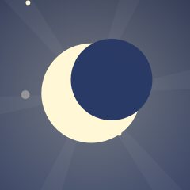
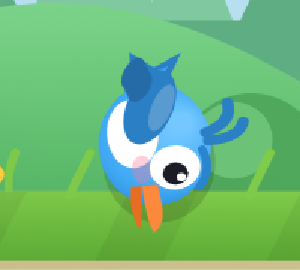
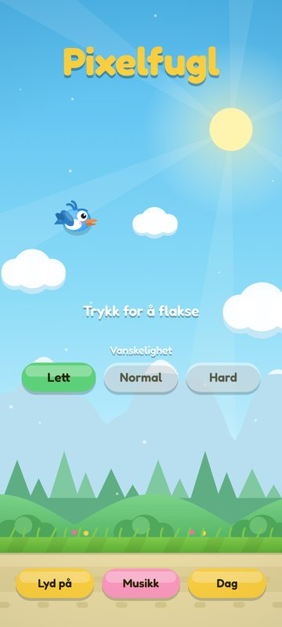
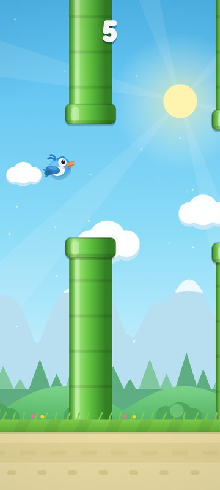
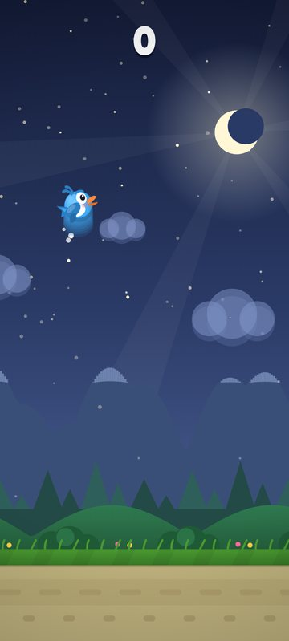
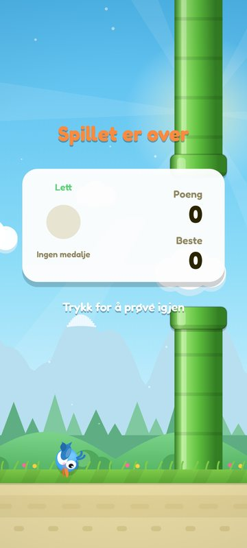

# Revisjon av Pixelfugl (v3)

**Dato:** 8. oktober 2026
**Omfang:** `index.html` (hele spillet), `sw.js`, `manifest.webmanifest`, `make_icons.py`, ikoner
**Metode:** Kodegjennomgang linje for linje + kjøring i Chromium (Galaxy-format, 412 × 915, DPR 2–2,6) med skjermbilder fra meny, spill, krasj og game over, i dag- og nattema.

> **Status:** Fase 1 og fase 2 er gjennomført (se seksjon 10). Fase 2 ga spillet ny
> kunstnerisk retning med **bjørkestammer** som hinder.

---

## 1. Sammendrag

Pixelfugl har et solid teknisk grunnlag: tidsbasert fysikk, parallakse, syntetisert lyd, PWA og
offline-støtte. Dette er mer enn de fleste hobbyprosjekter har. Problemet er at **mange små
detaljer trekker helhetsinntrykket ned fra «profesjonelt» til «hjemmelaget»**, og at
**stemningen i dag er «generisk mobilspill»** (grønne Mario-rør, skarpe solstråler, chiptune med
trommer) i stedet for **koselig og søt**.

De viktigste funnene:

| # | Funn | Område | Alvorlighet |
|---|------|--------|-------------|
| 1 | Ingen interpolering mellom fysikk-steg → hakking på 90/120 Hz-skjermer (Samsung) | Fysikk / animasjon | **Høy** |
| 2 | Fartssporet tegnes som ~26 fuglekopier → ser ut som en blå «søyle» bak fuglen | Effekter | **Høy** |
| 3 | Snøtoppene på fjellene er tegnet som 2 px-striper → synlig trappetrinn | Grafikk | **Høy** |
| 4 | Månen lages ved å tegne en himmelfarget sirkel over sola → synlig mørk skive | Grafikk | **Høy** |
| 5 | Ingen vei tilbake til menyen etter game over (vanskelighetsgrad kan ikke byttes uten omstart av appen) | UX | **Høy** |
| 6 | Ingen pause; spillet og musikken fortsetter når appen legges i bakgrunnen | UX / lyd | **Høy** |
| 7 | Skjold-power-up «teleporterer» fuglen til midten av gapet | Fysikk / animasjon | Middels |
| 8 | Krasj: fuglen ligger opp-ned med hvit fullskjerm-blits → brutalt, ikke søtt | Stemning / effekter | Middels |
| 9 | Spillbart område avhenger av skjermhøyde → vanskelighetsgraden varierer mellom telefoner | Spilldesign | Middels |
| 10 | Kunstnerisk retning: ingenting i spillet signaliserer «koselig» | Stemning | **Høy** (for målet ditt) |

Seksjon 3–8 går gjennom alt i detalj. Seksjon 9 er et konkret forslag til koselig kunstnerisk
retning, og seksjon 10 er en prioritert plan i faser.

---

## 2. Dette fungerer bra (behold)

- **Fast fysikk-steg (120 Hz)** med `dt`-tak og akkumulator (`index.html:828-838`). Riktig grunnarkitektur.
- **Kollisjon sirkel mot avrundet rektangel** (`index.html:322-333`). Presis og litt tilgivende. Bra for et koselig spill.
- **Fjærbasert rotasjon** og **squash & stretch** på fuglen (`index.html:365-372`).
- **Parallakse i fem lag** som alle drives av én `scroll`-verdi. Enkelt å utvide.
- **Lyd som planlegges med lookahead** (Web Audio-sekvenser, `index.html:195-197`). Stabil timing.
- **Respekt for `prefers-reduced-motion`** (delvis, se 6.4).
- **PWA**: manifest, service worker, installknapp, safe-area-håndtering.
- Fuglefiguren har allerede søte elementer (kinn, stort øye, mage) som kan bygges videre på.

---

## 3. Grafikk

### 3.1 Snøtopper med trappetrinn (Høy)
`index.html:519-523` tegner snøen som 2 px brede `fillRect`-striper. Resultatet blir en synlig
trappeform som svever over fjellsilhuetten:

**Tiltak:** Tegn snøen som én sammenhengende sti (samme kurve som fjellet, klippet med
`ctx.clip()` over en høydegrense), eller enda bedre: forhåndstegn hele fjell-laget på et
offscreen-lerret (se 8.1).

### 3.2 Månen er en sol med en «bit» over (Høy)
`index.html:502` lager halvmånen ved å tegne en sirkel i `T.skyMid` over sola. Himmelen er en
gradient, så sirkelen får en annen farge enn bakgrunnen og blir en synlig mørk skive:

**Tiltak:** Bruk `globalCompositeOperation = 'destination-out'` på et eget lag, eller tegn
halvmånen som en sti med to buer. Gi den gjerne et søtt, søvnig ansikt (se 9).

### 3.3 Solstrålene er for harde og for store (Middels)
Seks hardkantede trekanter på 420 px dekker halve skjermen og roterer (`index.html:496-500`). De
konkurrerer med spillelementene og gir et «kasino/reklame»-preg.
**Tiltak:** Erstatt dem med en myk radial glød (bloom) og eventuelt svært svake, uskarpe
lysstråler med lav opasitet og gradient i hver stråle.

### 3.4 Skyer konkurrerer med spillelementene (Middels)
Skyene er knallhvite, nesten like store som fuglen, og ligger i samme «visuelle plan» som rørene.
I game over-skjermen stikker en sky ut under panelet. **Tiltak:** Lavere kontrast, mer
atmosfærisk perspektiv (lysere og blåere jo lenger bak), og to skylag med ulik fart.

### 3.5 Bakgrunnen er komprimert nederst; toppen er tom (Middels)
Logisk bredde er låst til 288 px, og høyden følger skjermen (`index.html:813`). På en 20:9-telefon
blir det ~640 logiske px. Alle lag er festet til bakken, så den øverste halvdelen er bare
gradient. **Tiltak:** Plasser lag relativt til høyden (prosent), legg til elementer i høyden
(fjerne fugler, luftballong, drager, stjernebilder), og gi himmelen mer dybde.

### 3.6 Skog og åser er flate geometriske former (Lav/Middels)
Trærne er rene trekanter, og skogen har et heltrukket rektangel bak seg (`index.html:532`).
**Tiltak:** Avrundede trekroner, små variasjoner (seed-basert tilfeldighet per tre), myk
atmosfærisk dis mellom lagene.

### 3.7 Bakken ser ut som en vei (Lav/Middels)
Det beige feltet med pilleformede «striper» (`index.html:561-565`) ser ut som asfalt/fortau.
**Tiltak:** Gress, blomster, småstein, sopp, et lite gjerde, eller jordlag med røtter.

### 3.8 Rørene (Høy for stemningen)
Grønne, skinnende industrirør med ringer er et direkte lån fra Flappy Bird/Mario. De er det
største elementet på skjermen og bestemmer derfor stemningen mest. Se 9.2 for koselige
alternativer.

### 3.9 Fuglen
Bra utgangspunkt, men:
- **«Sint» øyenbryn** (`index.html:649`) gir et irritert uttrykk. Fjern det eller gjør det blidt.
- Detaljer (fjærtopp, halefjær, vingesegmenter) blir grumsete i liten størrelse.
- Kroppen er en liten ellipse; søte figurer har **stort hode, stor kropp, store øyne med to
  lyspunkter, små føtter**.
- Ingen blunking eller ansiktsuttrykk.

### 3.10 Ikoner (Lav)
`make_icons.py` tar imot `maskable`, men bruker den aldri. `icon-maskable-512.png` er
**byte-for-byte identisk** med `icon-512.png`. Ved nærmere sjekk ligger fuglen akkurat innenfor
den sikre sonen (sirkel med diameter 80 %), men uten margin, og vingen nesten treffer kanten i
runde ikonmasker. **Tiltak:** Skaler motivet litt ned for maskable, slik at det får luft.

---

## 4. Animasjoner

### 4.1 Hakking på 90/120 Hz-skjermer (Høy)
Fysikken går i 120 Hz-steg, og `render()` tegner siste fysikk-tilstand uten interpolering
(`index.html:829-838`). På en 90 Hz Samsung-skjerm blir det 1, 1, 2, 1, 1, 2 … steg per bilde,
og alt som beveger seg får en ujevn rytme. Ved 120 Hz gir rAF-jitter av og til 0 eller 2 steg.
Dette er den viktigste enkeltgrunnen til at bevegelsen ikke føles «profesjonell».
**Tiltak:** Lagre forrige tilstand (`prevX/prevY/prevRot`, forrige `scroll`, rørposisjoner) og
tegn med `alpha = acc / STEP` → `lerp(prev, cur, alpha)`. Standardteknikk («Fix Your Timestep»).

### 4.2 Skjold «teleporterer» fuglen (Middels)
`useShield()` setter `bird.y = p.top + p.gap / 2` direkte (`index.html:448`). Fuglen hopper
momentant. **Tiltak:** Gi 0,6 s usårbarhet med blinking, og la fuglen glide (fjær-tween) mot
midten av gapet.

### 4.3 Krasj og død (Middels)
Fuglen tumler, spretter og blir liggende **opp-ned** (`rot = 1.5`, `index.html:423/455`):

Det oppleves som «død», ikke søtt. **Tiltak:** «Bonk!» → fuglen klemmes flat, spretter, lander
sittende, svimle stjerner/småfugler sirkler rundt hodet, øynene blir til spiraler eller «× ×»
med et lite «pfff». Ingen hvit fullskjerm-blits.

### 4.4 UI-animasjoner er lineære eller mangler (Middels)
- Panelet på game over bruker en enkel cubic ease-out; ingen «overshoot».
- Knapper har ingen trykk-animasjon (canvas-knappene reagerer ikke visuelt).
- Overgangen MENU → READY er en mørk 45 %-tone (`index.html:805`).
- Poengtallet teller opp lineært.

**Tiltak:** Et lite tween-bibliotek (20–30 linjer) med `easeOutBack`, `easeOutElastic` og
fjær-funksjoner. Knapper som klemmes ved trykk, panel som «popper» inn, medaljen som snurrer inn,
myke fargeoverganger (iris/sirkel-wipe eller sky-wipe) mellom skjermer.

### 4.5 Fuglen er «død» i hvile (Lav)
I meny/klar-modus vugger fuglen bare opp og ned. **Tiltak:** Idle-animasjoner: blunk hvert 2–5 s,
ser rundt seg, rister på fjærene, et lite hopp. Små ting som gir liv.

### 4.6 Vingen (Lav)
Én vinge som roteres. **Tiltak:** 3–4 keyframes (opp/midt/ned/følge), og sekundærbevegelse på
halefjær og fjærtopp (de henger litt etter kroppen).

---

## 5. Effekter

### 5.1 Fartssporet (Høy)
En ny «spøkelsesfugl» legges til **hvert fysikk-steg** (120 per sekund) når `|vy| > 200`, og
lever i 0,22 s (`index.html:375`). I `DEAD`-tilstand legges det til uten betingelse
(`index.html:417`). Det blir ~26 overlappende kopier, som ser ut som en blå stolpe:

**Tiltak:** Fjern sporet, eller begrens til et fåtall punkter (f.eks. hver 40. ms) med
avtagende størrelse. Koseligere alternativ: små fjær som drysser og daler ned, og «puff»-skyer
ved hvert flaks.

### 5.2 Hvit blits og risting (Middels)
- `flash = 1` gir 80 % hvit fullskjerm (`index.html:452/804`). Ubehagelig og kan være et
  problem for lysfølsomme. `reduceMotion` slår **ikke** av blitsen.
- Ristingen bruker `Math.random()` per bilde (`index.html:732`), som gir «støy-risting» i stedet
  for en myk, dempet svingning.

**Tiltak:** Erstatt blitsen med en kort, myk vignett eller fargetoning. Bruk dempet
sinus/Perlin-risting med retning (bort fra treffpunktet), og slå av alt i `reduceMotion`.

### 5.3 Partikler (Lav/Middels)
Alle partikler er sirkler. **Tiltak:** Tematiske partikler: små hjerter/stjerner ved poeng, fjær
ved flaks og krasj, støvskyer ved bakken, blader/frø som blåser forbi. Bruk et partikkel-basseng
(pool) i stedet for `splice` for jevnere ytelse.

### 5.4 Vignett (Lav)
Mørk vignett på dagtid gir en trist/dyster kant. **Tiltak:** Varm, lys vignett (krem/ferskenfarget)
på dag, og en mørkeblå vignett kun på natt.

---

## 6. Fysikk og dynamikk

### 6.1 Flaks-impulsen kan «stables» (Middels)
`bird.vy = Math.min(bird.vy, 0) * 0.25 + D.flap` (`index.html:292`). Med rask tapping
konvergerer stigefarten mot `flap / 0.75`, altså **33 % mer løft** enn ett enkelt flaks. Samme
trykk gir ulikt resultat avhengig av rytmen, noe som føles upresist.
**Tiltak:** Fast impuls (`vy = D.flap`), eller begrens bidraget (`Math.max(..., D.flap * 1.08)`).

### 6.2 Spillbart område varierer med skjermen (Middels)
Siden `H` følger skjermhøyden, varierer avstanden mellom tak og bakke fra telefon til telefon.
Gapets høyde trekkes jevnt over hele området (`index.html:266`), så høye telefoner får større
hopp mellom påfølgende gap. **Tiltak:** Definer en fast «spillsone» (f.eks. 480 logiske px) og
bruk ekstra høyde kun til himmel/dekor. Begrens også endringen mellom to påfølgende gap
(f.eks. maks 120–140 px) for bedre flyt.

### 6.3 Hard-modus kan bli urimelig (Middels)
Gapet krymper med opptil 27 px (`index.html:261`), og «smal»-varianten ganger med 0,8. På Hard
etter 30 poeng: 112 − 27 = 85 → **68 px gap**. Med fuglens radius gir det ca. 48 px klaring,
mindre enn høyden på ett flaks (≈ 50 px). **Tiltak:** Sett et absolutt minimum (f.eks. 92 px),
og la «smal» kun forekomme når den ikke kombineres med maks innsnevring.

### 6.4 Bevegelige rør (Lav)
Amplitude 26 px og frekvens 2,2–3,4 rad/s gir opptil ~88 px/s vertikal hastighet med brå
retningsskifter. **Tiltak:** Lavere frekvens, og en «pust»-kurve (ease-in-out) i stedet for ren
sinus, slik at spilleren kan lese mønsteret.

### 6.5 Ingen «tilgivelse» (Lav, men viktig for koselig)
Koselige spill tilgir: litt mindre treffboks enn grafikken, en kort nådeperiode etter skjold,
og muligheten for en «Zen-modus» uten død. Treffboksen i dag er allerede litt tilgivende (r = 10
mot en grafisk kropp på 15 × 12). Behold det.

---

## 7. Lyd

### 7.1 Musikken passer ikke til «koselig» (Høy for stemningen)
128 BPM, firkant-/sagtann-bølger og kick/snare/hi-hat (`index.html:157-193`) gir en energisk
arkadestemning. **Tiltak:** 80–96 BPM, myke instrumenter (spilledåse, kalimba, marimba, filtpiano,
plukket gitar/ukulele), F-dur/G-dur med sus4- og add9-akkorder, ingen hard kick. I spill kan man
legge til en myk shaker og lav bass i stedet for trommer.

### 7.2 Lydeffekter
- `hit()` er hvit støy + sagtann-glid nedover (`index.html:220`). Høres ut som en eksplosjon.
  → Myk «bonk/boing» (sinus med rask pitch-sprett) og et lite «pip».
- `point()` er to høye sinustoner. → Klokkespill/xylofon der tonen **stiger i skala** for hvert
  påfølgende poeng (gir flyt og belønning).
- `flap()` → myk «fwip» (filtrert støy + lavt sinus-puff).
- `sting()` (game over) er en fallende moll-figur. → Søt, liten «å nei»-melodi i dur med sukk.

### 7.3 Lyd i bakgrunnen (Høy)
Ved `visibilitychange` nullstilles bare `lastTime` (`index.html:313`). `AudioContext` suspenderes
ikke, så musikken fortsetter når appen er i bakgrunnen. Samtidig strupes `setInterval` til ca.
1 Hz i bakgrunnen, så sekvenseren hakker. **Tiltak:** `ac.suspend()` når skjult, `ac.resume()` ved
retur, og automatisk pause i spillet.

### 7.4 Atmosfærelyder (forslag)
Fuglekvitter og vind på dag, sirisser og ugle på natt, svakt og i bakgrunnen.

---

## 8. UI/UX og teknikk

### 8.1 Ytelse og arkitektur
- **Statiske lag tegnes på nytt hvert bilde.** Fjellet beregnes med sinus for hver 2.–5. piksel,
  gradienter lages på nytt hvert bilde (himmel, sol, vignett, rør, power-ups). På rimelige
  Android-telefoner med DPR 2,6 er det GPU-fyllraten som begrenser.
  **Tiltak:** Forhåndstegn hvert parallakselag og fuglens vingeposisjoner på offscreen-lerreter
  (ved oppstart/resize/temabytte) og blit med `drawImage`. Det gir både bedre ytelse og rom for
  mye rikere detaljer (teksturer, korn, myke skygger) uten ekstra kostnad per bilde.
- **Én fil på 850 linjer.** Del i ES-moduler uten byggesteg: `physics.js`, `render/*.js`,
  `audio.js`, `ui.js`, `config.js`. Det gjør videre arbeid tryggere.
- `const Audio` overskygger nettleserens innebygde `Audio`-konstruktør. Gi den nytt navn
  (`Sound`).
- `localStorage` brukes uten `try/catch` på toppnivå (`index.html:73`). I enkelte private moduser
  kaster dette en feil, og spillet starter ikke.

### 8.2 Navigasjon (Høy)
- `goMenu()` kalles bare ved oppstart (`index.html:849`). Fra game over går et trykk rett til
  «Klar?», så **det finnes ingen vei tilbake til menyen** for å bytte vanskelighetsgrad, tema eller
  lyd.
- **Ingen pauseknapp**, og ingen automatisk pause når appen mister fokus.

**Tiltak:** Game over-panel med to tydelige knapper («Spill igjen» og «Meny»), en pauseknapp i
spill, og auto-pause ved `visibilitychange`/`blur`.

### 8.3 Knapper og tekst
- Etikettene viser tilstand, ikke handling: «Lyd på», «Dag». Det er tvetydig.
  → Bruk ikoner (høyttaler, note, sol/måne) med en tydelig av-tilstand (strek over).
- Valgte vs. ikke-valgte vanskelighetsknapper: de ikke-valgte ser **deaktiverte** ut (grå).
  → Bruk kontur/mindre fylt stil i stedet for grå.
- «Ingen medalje» vises som en tom grå sirkel som ser ut som en plassholder.
  → Vis en søt «egg»-medalje eller en oppmuntrende melding («Nesten! 3 til bronse»).
- Tittelen «Spillet er over» havner over rørene og konkurrerer med bakgrunnen. Panelet bør ha et
  dempet lag bak seg.
- Ingen tilgjengelighet for skjermlesere eller tastaturfokus på canvas-knappene.

### 8.4 PWA
- Fonten lastes fra Google Fonts. Første oppstart uten nett gir systemfont.
  → Self-host Fredoka (woff2) og legg den i `CORE` i `sw.js`.
- `.nojekyll` nevnes i README, men finnes ikke i repoet. Filen `download` er tom (0 byte) og kan
  slettes.
- README oppgir fart som «1.9/2.2/2.6», mens koden bruker px/s (118/136/160). Manifestet sier
  «retro», og `index.html` sier «moderne». Velg én beskrivelse.

### 8.5 Navn vs. stil
Spillet heter **Pixel**fugl, men alt er glatt vektorgrafikk. Enten (a) gå over til ekte pikselkunst
(krisp, heltallsskalering, begrenset palett), eller (b) behold vektorstilen og vurder navnet. For
«koselig og søt» anbefales **myk vektor / «bildebok»-stil**. Det er det som gir mest
profesjonelt resultat med koden slik den er bygget.

---

## 9. Koselig og søt: forslag til kunstnerisk retning

**Stikkord:** varmt lys, pastellfarger, myke former, ingen skarpe kanter, små detaljer som
belønner nysgjerrighet. Tenk norsk «kos»: hytte, strikk, lys i vinduene, bjørk, peiskos.

### 9.1 Palett
| Rolle | Dag (gyllen morgen) | Natt (koselig kveld) |
|-------|---------------------|-----------------------|
| Himmel topp | `#9AD7F5` | `#2B2D5C` |
| Himmel bunn | `#FFE9D2` (fersken) | `#7D6BA8` (lavendel) |
| Fjell | `#C9D8F0` | `#4A4A7A` |
| Åser | `#A8DDA0` / `#86C98A` | `#3F6B5E` |
| Aksent varm | `#FFB38A` (korall) | `#FFD27A` (lampelys) |
| Aksent søt | `#FF9EB5` (rosa) | `#F7A8C8` |
| Tekst/kontur | `#5B4636` (varm brun i stedet for svart) | `#FFF4E0` |

Bruk **varm brun kontur** (1–1,5 px) i stedet for svarte skygger. Det er hemmeligheten bak de
fleste «cozy»-spill.

### 9.2 Hinder i stedet for grønne rør (velg én retning)
1. **Bjørkestammer** med mose, små sopper og en ugle som titter ut av et hull. Toppen er en
   avkappet stubbe med årringer.
2. **Stablede blomsterpotter / tekopper** med planter som vokser ut av dem.
3. **Gjerdestolper med vimpler** og lyslenker som tennes om natten.
4. **Skyer/lyspilarer** (for en drømmeaktig variant).

Varianter: bevegelige hinder = stammer med en ekorn som hopper; smale = to bjørker som lener seg
mot hverandre.

### 9.3 Bakgrunn
- Små røde hytter med lys i vinduene og røyk fra pipa (røyken følger vinden).
- Fjell med myk snø, ferjer/seilbåt i en fjord, en luftballong som driver forbi.
- **Dag–natt-syklus i løpet av en runde:** morgen → ettermiddag → solnedgang → stjernekveld
  med ildfluer (f.eks. et nytt tidspunkt for hver 10. poeng). Gir progresjon og variasjon.
- Fallende blader om høsten, snø om vinteren (sesong basert på dato) for ekstra sjarm.

### 9.4 Fuglen
- Rundere og større hode, store glitrende øyne (to lyspunkter), rosa kinn, bitte små føtter.
- **Strikket skjerf** som flagrer med sekundærbevegelse. Fargen kan låses opp/velges.
- Ansiktsuttrykk: glad ved poeng (lukkede «^ ^»-øyne et øyeblikk), konsentrert ved fall,
  svimmel ved krasj, søvnig i menyen om natten.
- Kosmetikk som kan låses opp med frø/bær: lue, briller, blomst i fjærtoppen.

### 9.5 Samleobjekter og power-ups
- Bær/frø/små hjerter i gapene i stedet for abstrakte kuler.
- Skjold → **såpeboble** rundt fuglen som «popper» mykt.
- Sakte film → **snegle** eller **fjær** (alt daler rolig, varm sepia-toning).
- Dobbel → **gyllen eikenøtt**.

### 9.6 Juice som føles søt, ikke voldsom
- Poeng: et lite «pling» med stigende tone, hjerte-/stjernepartikler, poengtallet hopper med
  `easeOutBack`.
- Flaks: liten fjær og «puff»-sky.
- Krasj: «bonk», sprett, svimle stjerner. Ingen blits, maks 3–4 px dempet risting.
- Nytt rekord: konfetti av blomsterblader og en liten jubel-animasjon.
- Mikrotekster med personlighet: «Nesten!», «Kos deg!», «Én gang til?».

---

## 10. Prioritert plan

Forslaget er delt i faser slik at hver fase kan leveres, testes og vurderes for seg.

### Fase 1: Rett feil og grunnmur (fra «hjemmelaget» til «solid») ✅ Gjennomført
1. Render-interpolering mellom fysikk-steg (4.1).
2. Fjern/erstatt fartssporet (5.1), fjern hvit blits, myk risting (5.2).
3. Fiks snøtopper (3.1) og månen (3.2).
4. Pause, auto-pause og `AudioContext.suspend` i bakgrunnen (7.3, 8.2).
5. Game over-panel med «Spill igjen» og «Meny» (8.2).
6. Fast flaks-impuls, fast spillsone, minimum gap, maks høydeendring mellom gap (6.1–6.3).
7. Skjold uten teleport (4.2).
8. Små tekniske ting: `try/catch` rundt `localStorage`, gi `Audio` nytt navn, maskable-ikon,
   self-hostet font.

### Fase 2: Ny kunstnerisk retning (koselig og søt) ✅ Gjennomført
1. Ny palett og varme konturer (9.1).
2. Forhåndstegnede parallakselag på offscreen-lerreter (8.1) med hytter, bjørk og fjord (9.3).
3. Nye hinder (9.2) og nye power-ups/samleobjekter (9.5).
4. Ny fugl med skjerf, ansiktsuttrykk og idle-animasjoner (9.4, 4.5, 4.6).
5. Ny krasj-sekvens med «bonk» og svimle stjerner (4.3).

### Fase 3: Lyd og juice
1. Ny, rolig musikk (spilledåse/kalimba, 80–96 BPM) og nye, myke lydeffekter (7.1, 7.2).
2. Atmosfærelyder for dag og natt (7.4).
3. Tween-system og UI-animasjoner (4.4), tematiske partikler (5.3).

### Fase 4: Innhold og sjarm
1. Dag–natt-syklus gjennom en runde og sesonger (9.3).
2. Kosmetikk som kan låses opp (9.4).
3. Zen-modus uten død (6.5).
4. Del koden i moduler (8.1) og oppdater README.

---

## Vedlegg: skjermbilder fra revisjonen

| Meny (dag) | I spill | Natt | Game over |
|---|---|---|---|
|  |  |  |  |
